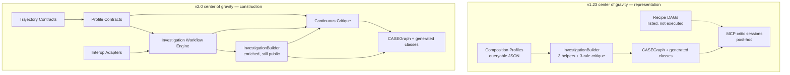

# CASE-UCO-SDK v2 — Coherent Construction Re-Architecture

| Field | Value |
|---|---|
| **Document** | Investigation Graph Construction Re-Architecture (v2.0.0) |
| **Author** | CASE/UCO SDK architecture (draft) |
| **Date** | 2026-08-15 (rev 3 — ID keys, trajectory import, API nits) |
| **Status** | Draft |
| **Repository** | `C:\Users\fores\CASE-UCO-SDK` (`forest-savage1234/CASE-UCO-SDK`) |
| **Branch** | `feature/v2-capability-defining-rearchitecture` (based on `origin/main` @ `f75e69d`) |
| **Current shipped version** | `1.23.1` (`python/case_uco/__init__.py`) |
| **Target generation** | `2.0.0` |
| **Upstream context** | Topology Framework PR #106 (`vulnmaster/CASE-UCO-SDK`); trajectories metamodel PR #104 studied for ideas only |

---

## Overview

The Topology Articulation & Optimization Framework already made the ontology *navigable*: seven Composition Profiles, incremental generate, fluent helpers, `InvestigationBuilder`, hash indexes, `partition_by_profile`, three recipe DAGs, a VICS/PhotoDNA mapping stub, and a permanent `TOPOLOGY.md`. That work optimized **representation and discovery**. It did not yet optimize **correct, guided, scalable construction under operational pressure**.

This design makes construction the center of gravity. Composition Profiles become **runtime contracts**. An **Investigation Workflow Engine** becomes the recommended primary path. **Continuous, profile-aware critique** runs as objects and steps are added, not only after serialize. Large cases are **partition-native**. CAC / forensic / legal **trajectories** and the highest-value **VICS / PhotoDNA / hash-intelligence** interop paths are first-class adapters under the same contract system. Low-level typed builders and the generator remain fully available. The new primary interface is additive wherever possible; the few intentional recommended-path changes are documented with a migration story and are strictly superior.

Investigation-time behaviour remains fully offline. No core OWL terms are invented. Ontology gaps stay change-proposal packages (`change_proposals/photodna-perceptual-hash-facet.md` is the model). Existing Topology tests remain the regression floor.

---

## Architectural thesis

The current system is optimized for flexible representation of cyber-investigation reality but only weakly optimized for correct, guided, scalable construction under operational pressure.

The new center of gravity is:

1. **Composition Profiles become runtime contracts.** A profile is no longer only a queryable JSON document plus a recipe skeleton. It is an evaluable, versioned contract: required/recommended Facet sets, mission checks, default validation bundle, default partition policy, related workflows, and repair hints.
2. **An Investigation Workflow Engine becomes the primary recommended construction path.** Operators and agents load a profile + scenario + evidence sources, execute a resumable multi-step workflow, and receive either a validated graph or structured remaining findings.
3. **Continuous, profile-aware critique is part of construction semantics.** Critique is not a post-hoc MCP session bolted on after `build()`. It runs incrementally on each add, at every workflow step boundary, and as a graph-wide pass before emit.
4. **Large-graph / partition awareness is native to the workflow model.** Field laptops stay inside the `docs/PERFORMANCE_GUIDE.md` envelope because the engine builds one graph per forensic boundary and validates partition-locally.
5. **Trajectory / phase modeling is unified under the same contract system.** Forensic lifecycle, CAC offense-trajectory, grooming-phase progression, and legal-process progression become contract objects that emit existing CASE/UCO/CAC terms — never new OWL.
6. **The highest-value interop paths (VICS / PhotoDNA / hash intelligence) are elevated into the same model** as offline adapters bound to `HashIntelligence` and `FullCACLifecycle`.

Power users are never abandoned. `CASEGraph.create`, generated Facet classes, `hasFacet`, and the generator remain the source of truth for typed ontology classes. `InvestigationBuilder` remains the mid-level API and becomes the workflow engine's default construction surface.



---

## Background & Motivation

### Current state (as implemented, not as planned)

`topology/sdk-layers.json` still records several *historical* bottlenecks ("no first-class Composition Profiles", "recipes are documents not executable DAGs"). The Topology Framework on `f75e69d` already closed a subset of those. The v2 design must not claim gaps that Phase 0–5 already filled. The following is the observed, code-backed topology.

#### Layer 0 — Baseline

`topology/` is a permanent, machine-readable articulation regenerated by `topology/scripts/build_baseline.py` (stdlib only, no network). Artifacts: `module-dependency-dag.*`, `class-and-facet-inventory.*` (~2,804 classes / 154 Facets / 78 modules), `composition-patterns.*` (extracted from the 77-recipe catalog), `semantic-spine.json`, `sdk-layers.json`, `baseline/verification.json`. Invariant tests live in `topology/tests/`.

#### Layer 1 — Semantic core

Seven versioned Composition Profiles live in `topology/profiles/` and are documented against `topology/profiles/profile.schema.json` (`additionalProperties: false`). **That schema is not CI-enforced today.** `topology/tests/test_profiles.py` checks a required-key set only; extra keys would pass. Phase 1 commit 1 adds `jsonschema.validate` of every profile (and later workflow / trajectory) document so the schema bump is real:

| Id | Role today |
|---|---|
| `MinimalForensics` | Smallest SHACL-valid evidence graph |
| `AirGappedFieldTriage` | Laptop / zero-egress + partition guidance |
| `HashIntelligence` | PhotoDNA / VICS-ready hashing |
| `ToolMapping` | Versioned tools, ConfiguredTool, SOLVE-IT |
| `LegalProcess` | Charges, pleas, PACER/docket |
| `FullCACLifecycle` | Hotline → grooming/trafficking → CSAM → rescue → court |
| `CrossOntology` | CASE/UCO + CAC + extensions + one upper profile |

Runtime loaders: `python/case_uco/topology/profiles.py` (`CompositionProfile`, `FacetSet`, `list_profiles`, `get_profile`, `recommend_profile`, `recommend_facet_set`). `case_uco.registry.list_profiles` / `get_profile` / `recommend_profile` are thin aliases that return `as_dict()`. Discovery is offline lexical ranking — no embeddings.

C# / Java / Rust ship a **compiled subset**: `csharp/CaseUco/CompositionProfiles.cs` (and Java/Rust equivalents) hard-code the seven IDs plus keyword ranking. They do **not** load `topology/profiles/*.json`, so they cannot see `facet_sets`, `required_modules`, `recipe_skeleton`, or future contract fields.

Queryable CAC spine: `python/case_uco/topology/spine.py` (`get_semantic_spine`, `list_spine_kinds`, `spine_kind_for_class`) over `topology/semantic-spine.json`. Kinds: `EnduringEntity`, `Occurrent`/`Event`, `Situation`, `Role`, `Phase`. Object properties already recorded: `hasPhase`, `isPhaseOf`, `assesses`, `generatedBy`, `usesMethod`.

CLI: `case-uco-explore profiles|profile|spine` in `generator/src/case_uco_generator/explore_cli.py` — JSON only, no OWL parse.

MCP: `list_composition_profiles`, `get_composition_profile`, `recommend_composition_profile`, `recommend_facet_set_for_profile`, `get_cac_semantic_spine`, resource `case-uco://composition-profiles`.

#### Layer 2 — Generation

`generator/src/case_uco_generator/incremental.py`: content-hashed IR under `generator/ir/` (`source-manifest.json`, `ontology-ir.json`, `IR_VERSION = "1.0.0"`). Unchanged Turtle SHA-256 → skip OWL parse (~0.8 s vs ~623 s full). Leaf extension change → `plan_reparse` mode `subset` (UCO+CASE + changed module + DAG dependents); core UCO/CASE change or `--force` → full parse. Generator remains the source of truth for typed classes. Fluent helpers are **not** generated; they are hand-written wrappers around generated Facet classes (`python/case_uco/helpers.py` and language equivalents).

#### Layer 3 — Runtime

`CASEGraph` (`python/case_uco/graph.py`) already provides:

- Typed `create` / `add` with required-field validation
- `serialize` / `write` plus `write_streaming` / `write_stream` (#71; atomic temp+rename, returns `{nodes, bytes_written}`)
- `load` / `load_file` with default `on_duplicate="reject"`
- `validate` (thin `case_validate` CLI wrapper) and `validate_report` (rich `GraphValidationReport` via `case_uco.validation.validate_graph_file`)
- `estimate_triples`
- `index_content_hashes` / `lookup_hash` (walks `uco-observable:hash` / `hashes` including nested Facets)
- `partition_by_profile(profile_id)` — **module-family heuristic** only: types matching `cacontology`/`cac-core` → `cac`; `legalproc`/`cryptoinv`/`rico`/`solveit`/`toolcap` → `extensions`; else `core`. Records `topology_profile` / `topology_partition` on each part. Docstring already prefers `partition_by_roots` for evidence graphs.
- `partition_by` / `partition_by_label` — experimental, **not** dependency-aware
- `partition` / `partition_by_roots` (#72) — BFS closure from roots, outgoing + incoming (Python/C#/Java; Rust outgoing-only). Optional `return_manifest` (`schema_version 1.0.0`)
- `split(max_objects)` — catalog-only; `docs/recipes/large-datasets.md` forbids it for investigation graphs

C#/Java serialize `byte[]` hash values as `xsd:hexBinary` (additive serialization fix). Python already emits typed literals via `typed_literal.py`.

Public validation contract: SHACL + closed-world concept coverage (`python/case_uco/validation/{graph,coverage,bundle}.py`). Coverage is role-aware and exact-term for upper profiles. `strict_concepts=True` with `profiles=None` authorizes **zero** upper profiles (CQ-29). Does not rewrite PySHACL; it shells out to `case_validate`.

#### Layer 4 — Agent / control (today)

`InvestigationBuilder` exists in all four languages (`python/case_uco/builder.py`, `csharp/CaseUco/InvestigationBuilder.cs`, `java/.../InvestigationBuilder.java`, `rust/src/builder.rs`):

```python
InvestigationBuilder(scenario, profile_id=None, kb_prefix="http://example.org/kb/")
.add_file(file_name, hashes=None, **kwargs)
.add_csam_evidence(file_name, hashes, **kwargs)
.add_tool_run(tool_name, action_name, tool_version=None, **kwargs)
.build() -> CASEGraph
.critique() -> list[dict[str, str]]   # severity, message, path
```

Inline critique is **three rules only**:

| Trigger | Severity (today) | Message |
|---|---|---|
| `add_file` with empty hashes | `error` | `{file}: {profile} requires ContentDataFacet hashes` |
| `add_csam_evidence` with empty hashes | `error` | `{file}: CSAM evidence must carry hashes` |
| `add_tool_run` with no version | `warning` | `Tool {name} has no version` |

`build()` returns the graph with **no** Facet-set walk, **no** SHACL, **no** concept coverage, **no** critic heuristics, **no** HashIntelligence / FullCACLifecycle mission checks. Findings are not stable-ID'd, not repair-guided, and not compatible with `mcp_server/critic/models.py::CriticFinding`.

MCP `build_investigation(scenario, profile_id)` constructs an **empty** builder and returns `{profile_id, object_count, critique, estimated_triples}`. It cannot ingest evidence.

Three recipe DAGs exist under `topology/recipe-dags/` as `{id, version, profile, recipe, description, nodes[], edges[]}` documents. `nodes` are `{id, kind, tool, args?, optional?}`; `edges` are `[from, to]` pairs. They are **not** a flat tool list:

| File | Nodes (in edge order) | Notes |
|---|---|---|
| `field-triage.json` | `get_composition_profile` → `build_investigation` → `validate_graph` | No route, no critic |
| `cac-grooming-chat.json` | `route_cac_content` → `get_composition_profile` → `build_investigation` → `validate_graph` → `start_critic_review` | Linear |
| `cac-csam-provenance.json` | `route_cac_content` → `get_composition_profile` → optional `process_document_file` → `build_investigation` → `validate_graph` → `start_critic_review` | `discover` has edges to both `process` and `build` |

MCP `list_recipe_dags` only **lists** the existing JSON documents (it must keep returning that same shape). There is no executor, no state file, no resume, no partition, no parallel, no critique-at-step. Promotion to workflows must preserve optional nodes (e.g. `process_document_file`).

The MCP critic (`mcp_server/critic/`, issues #75–#78) is a mature **post-hoc acceptance loop**: `analyze_artifact`, two-pass sessions (`REQUIRED_PASSES = 2`, hard cap 8), `CanonicalGraphView`, 18 `CRIT-H-*` heuristics (v1.3.3), serializer AST rules, coverage/provenance sidecars, tamper-evident `audit.jsonl`, scorecard, handoff. Finding identity is `CRIT-` + SHA-256 of `rule_id|semantic target`. This critic lives under `mcp_server/` and is **not** importable from an installed `case-uco` wheel. It is the right acceptance gate. It is the wrong construction-time loop.

`docs/recipes/recipe-execution.schema.json` is a **quality-gate manifest** for recipe exemplars (builder + output + SHACL/SPARQL), not an operational workflow runner.

#### Layer 5 — Interop (today)

- `topology/mappings/vics.json` — mapping **stub**, `status: stub`, air-gapped, no client.
- `docs/recipes/vics-hash-intelligence.md` — documents the interim pattern.
- `model_csam_evidence` records PhotoDNA as extra `Hash(hashMethod="PhotoDNA")` plus `Tool` + `InvestigativeAction`. Explicitly does not invent `PhotoDNAFacet`.
- `change_proposals/photodna-perceptual-hash-facet.md` — upstream proposal for `observable:PerceptualHashFacet` (UCO 1.6.0 target). Not in core.
- No catalog ingest, no match-distance object, no VICS Media ID adapter.

#### Facet pattern (today)

Generated Facet classes (`FileFacet`, `ContentDataFacet`, `RasterPictureFacet`, `DeviceFacet`, …) attach via `uco-core:hasFacet`. Helpers encode the three most common bundles:

- `file_with_content_hashes` → `ObservableObject` + `FileFacet` + `ContentDataFacet`
- `raster_picture_with_hashes` → `RasterPicture` + `FileFacet` + `ContentDataFacet` + `RasterPictureFacet`
- `model_csam_evidence` → hashed `RasterPicture` + hashing `Tool` + `InvestigativeAction`
- `model_tool_run` → versioned `Tool` + `InvestigativeAction`

Rust Facet inheritance is still generated as standalone structs; helpers attach Facets via `uco-core:hasFacet` (documented idiomatic difference in `docs/CROSS_LANGUAGE_PARITY.md`).

#### Trajectories (today, local — not PR #104 code)

Upstream PR #104 (`feat: trajectories metamodel`) is **not present** in this fork. This design absorbs the *ideas* (first-class ordered phases + transitions as a metamodel, queryable progression, construction-time checks) and unifies them with what already exists locally — it does **not** merge foreign code.

Local trajectory surfaces already in-tree:

| Surface | What it is | Terms used |
|---|---|---|
| CAC spine `Phase` | `cac-core:Phase` / `hasPhase` / `isPhaseOf` | `topology/semantic-spine.json` |
| Offense-trajectory state machine | `InitialContactPhase` → `ConditioningPhase` → `ExploitationPhase` → `MaintenancePhase` linked by `cac-core:precedes`; `conditioningMode` on the macro node | `ontology/cac/ontology/docs/{glossary,design,architecture}.md` |
| Grooming phases | `OnlineGrooming.hasPhase` → `InitialContactPhase` → `TrustBuildingPhase` (deprecated label → ConditioningPhase) → `IsolationPhase` → `SexualizationPhase` | `docs/recipes/cac-grooming-chat-modeling.md` |
| Forensic lifecycle | `ActionLifecycle.phase` → `ArrayOfAction` of Survey/Preservation/Examination/Analysis/Reporting; actions `Mapped_Into` phases | `docs/recipes/forensic-lifecycle.md` |
| Legal outcomes | `phaseStatus` gap already a change proposal | `change_proposals/cac-legal-outcomes-charging-properties.md` |
| AEO Storyline | "semi-ordered planned events as an expected trajectory for a narrative" | AEO engagement module — out of CAC construction path |

There is **no** SDK type that names a trajectory, advances a phase, or critiques a missing `precedes` link.

#### Multi-language

`docs/CROSS_LANGUAGE_PARITY.md` already lists helpers, `InvestigationBuilder`, hash index, and `partition_by_profile` as identical operations. Asymmetric: Rust `partition_by_roots` is outgoing-only; property-metadata cache is N/A in Rust.

Known loader inconsistency (fix in this generation, non-breaking):

- Python injects CAC prefixes only when `"ext.cac" in " ".join(profile.required_modules)`. `HashIntelligence.required_modules` does **not** include `ext.cac` (it is recommended).
- C# `CompositionProfiles.RequiresCac`, Java `requiresCac`, and Rust `requires_cac` return true for **both** `FullCACLifecycle` and `HashIntelligence`.

#### Air-gap / packaging hole

`python/case_uco/topology/paths.py` searches `CASE_UCO_TOPOLOGY_DIR`, the repo `topology/profiles/`, then `case_uco/topology/data/profiles`. The packaged `data/profiles` directory **does not exist**. Copying files into the source tree is not enough: `python/pyproject.toml` has `include-package-data = false` and `[tool.setuptools.package-data]` lists only `_registry.json`, `_concept_index.json`, `validation/upper_ontology_registry.json`, and `py.typed`. A wheel-only install cannot load profiles unless the env var points at a checkout. Spine already has an in-process fallback (`_FALLBACK_SPINE` in `spine.py`); profiles do not — `InvestigationBuilder` on a pip-only install already fails when no profile JSON is found. All seven profiles declare `"air_gapped": true`.

### Pain points under operational pressure

1. **Guidance is documentary.** A field examiner or agent can *ask* what Facets a `RasterPicture` needs (`recommend_facet_set`) and then silently omit them. The builder will not complain until a human runs SHACL — if they remember, and if `case-utils` is installed, and if the graph still fits in RAM.
2. **Critique is a three-line accumulator.** It does not understand profiles, Facet sets, hash *methods*, tool provenance, SHACL, concept coverage, CAC role/phase rules, or VICS match completeness. Findings cannot be stably addressed across a session.
3. **Construction is not a workflow.** Recipe DAGs name tools; nobody runs them. There is no resumable state, no partition cursor, no safe parallelism, no "emit or tell me exactly what is still wrong."
4. **Large cases are documented, not enforced.** `docs/PERFORMANCE_GUIDE.md` is correct (15–25 triples/item; PySHACL ≈ 50 KB/record; 128k records ≈ 5 GB). `AirGappedFieldTriage.recipe_skeleton` says "one graph per volume." Nothing in the builder or MCP makes that the default execution path. `partition_by_profile` does not partition by forensic boundary.
5. **Trajectories are tribal knowledge.** Grooming-phase ordering, forensic lifecycle, and CAC `precedes` live in recipes and CAC docs. Agents re-derive them. PR #104's metamodel idea is the right *shape*; it must land as contracts, not as a parallel OWL pile.
6. **Hash intelligence is a helper, not a path.** `model_csam_evidence` is correct and court-defensible for digest bytes. It does not ingest a local VICS export, record match distance, or produce `AssessmentResult` / `ConfidenceFacet` as the `HashIntelligence` skeleton already describes.

These are not cosmetic. They are why the instrument is weaker than the ontology it wraps.

---

## Goals & Non-Goals

### Goals

- Make **profile-contracted, continuously critiqued, partition-aware workflows** the recommended way to build investigation graphs in v2.0.0.
- Keep every existing public constructor, helper, builder method, MCP tool, and Topology test working.
- Ship construction-time critique as a **reusable, testable SDK component** (not MCP-only).
- Make large ICAC / field-triage cases first-class: one graph per forensic boundary, streaming emit, partition-local validation.
- Unify forensic / CAC / legal trajectories under the contract system using **existing** OWL terms.
- Elevate VICS / PhotoDNA / hash-intelligence to offline adapters.
- Express the logical surface in all four languages; implement the full engine Python-first.
- Absorb every high-value non-breaking improvement that belongs inside this coherent re-architecture (listed below).
- Preserve air-gapped investigation-time behaviour. Vendor profiles, workflows, mappings, and adapters.

### Non-Goals

- Inventing core OWL terms, PhotoDNAFacet in instance data, or native VICS types.
- Merging upstream PR #104 code. Ideas only.
- Rewriting PySHACL / `case_validate`. Stay on `case_uco.validation.validate_graph_file`.
- Replacing generated builders, `CASEGraph.create`, or the generator IR.
- Replacing the MCP critic acceptance loop. Construction critique **feeds** it; it does not delete it.
- Making InvestigationBuilder the *only* path, or making the workflow engine mandatory.
- Network VICS / PhotoDNA / NCMEC clients at investigation time.
- A general-purpose workflow product (Airflow, Temporal). This engine is investigation-graph construction only.
- Unrelated refactors (registry rewrite, ontology realignment, new extension ontologies, C# property-cache redesign).
- Dual BFO+gUFO typing (already an anti-pattern in `CrossOntology`).
- Changing SHACL + concept coverage as the validation contract.

---

## Proposed Design

### 1. New primary construction model

The recommended v2 path is:

```text
scenario + evidence sources
    → recommend / select Composition Profile
    → load Profile Contract
    → start InvestigationWorkflow (or resume state)
    → for each step (Phase 2: sequential single-graph; Phase 4+: optional
      independent-parallel across forensic-boundary partitions):
          execute handler (builder / adapter / trajectory / partition / emit)
          run continuous critique (incremental + step-boundary)
    → graph-wide critique + optional SHACL/coverage (per partition from Phase 4)
    → either emit validated JSON-LD or return remaining findings
```

`InvestigationBuilder` is the default **step implementation** for `kind: build`. Low-level `CASEGraph.create` remains available inside custom handlers and to power users. MCP `build_investigation` stays; new tools `start_investigation_workflow` / `resume_investigation_workflow` become the agent-facing primary path.

```mermaid
sequenceDiagram
  participant Op as Operator / Agent
  participant WE as InvestigationWorkflow
  participant PC as ProfileContract
  participant IB as InvestigationBuilder
  participant CC as ProfileCritic
  participant AD as Adapter
  participant G as CASEGraph

  Op->>WE: InvestigationWorkflow(workflow_id, profile_id, sources)<br/>then run()
  WE->>PC: load + bind
  WE->>CC: critique(step=init)
  loop each ready step
    alt kind = build
      WE->>IB: add_* / helpers
      IB->>G: create typed objects
      IB->>CC: incremental check
    else kind = adapter
      WE->>AD: ingest local catalog / hashes
      AD->>IB: model_csam_evidence / AssessmentResult
    else kind = partition
      Note over WE: Phase 4: split WorkItem list by boundary_key;<br/>one empty CASEGraph per key. Not partition_by_roots on a half-built graph.
      WE->>WE: worklist → partition builders
    end
    WE->>CC: step-boundary evaluate(contract, graph, step)
    CC-->>WE: CritiqueReport (stable IDs, repair hints)
    WE->>WE: persist WorkflowState (atomic)
  end
  WE->>CC: graph-wide (heuristics + optional SHACL/coverage)
  alt no blocking findings
    WE-->>Op: graphs + empty remaining[]
  else blocking findings remain
    WE-->>Op: graphs (partial) + remaining findings + resume cursor
  end
```

### 2. Profile Contracts

#### 2.1 What changes

Profiles remain JSON documents under `topology/profiles/`. The schema currently has `additionalProperties: false` and no check/partition/adapter/trajectory fields. v2 **extends the schema additively**:

- Bump `topology/profiles/profile.schema.json` to draft `2.0.0`.
- All new properties are **optional**. Existing `version: 1.0.0` profile documents remain valid.
- When a profile gains a `contract` object it bumps its own `version` to `2.0.0`.
- `python/case_uco/topology/profiles.py::_parse_profile` ignores unknown keys today only because it cherry-picks fields. The schema is **documentation** until Phase 1 adds `jsonschema` validation (see Layer 1). Update the schema, the dataclass, and the test together.

Vendor a copy of every profile JSON (and the schema) into `python/case_uco/topology/data/profiles/` **and** add `case_uco/topology/data/**/*.json` to `[tool.setuptools.package-data]` in `python/pyproject.toml` (today `include-package-data = false` and the glob is absent). Without that packaging step the files never enter the wheel. Phase 1 includes a wheel-install test: `get_profile("MinimalForensics")` works with `CASE_UCO_TOPOLOGY_DIR` unset and cwd outside the repo. C#/Java/Rust either embed the same JSON as resources or, in Phase 3, parse it at runtime (preferred) so they stop drifting from Python.

#### 2.2 Contract object (schema extension)

Add an optional `contract` property to `profile.schema.json`:

```json
"contract": {
  "type": "object",
  "additionalProperties": false,
  "required": ["schema_version", "checks"],
  "properties": {
    "schema_version": { "const": "1.0.0" },
    "default_validation": {
      "type": "object",
      "properties": {
        "extensions": { "type": "array", "items": { "type": "string" } },
        "profiles": { "type": "array", "items": { "type": "string" } },
        "strict_concepts": { "type": "boolean" },
        "require_shacl": { "type": "boolean" }
      }
    },
    "partition_policy": {
      "type": "object",
      "properties": {
        "strategy": { "enum": ["forensic-boundary", "roots", "module-family", "none"] },
        "boundary": { "enum": ["volume", "device", "app", "session", "mailbox", "catalog-batch"] },
        "shared_node_policy": { "enum": ["replicate-identical", "isolate-shared"] },
        "max_estimated_triples": { "type": "integer", "minimum": 1 }
      }
    },
    "workflows": { "type": "array", "items": { "type": "string" } },
    "trajectories": { "type": "array", "items": { "type": "string" } },
    "adapters": { "type": "array", "items": { "type": "string" } },
    "checks": {
      "type": "array",
      "items": { "$ref": "#/$defs/contractCheck" }
    }
  }
}
```

`contractCheck`:

| Field | Type | Meaning |
|---|---|---|
| `id` | string | Stable rule id, e.g. `PROF-HASH-001` |
| `when` | `incremental` \| `step` \| `graph` | When the engine must evaluate it |
| `severity` | `critical` \| `high` \| `medium` \| `low` \| `info` | Critic-compatible |
| `blocking` | boolean | Blocks `status=completed` if open |
| `applies_to` | string[] | Host **bundles** (`File`, `RasterPicture`, `Tool`, `*`) — resolved per §3.3, not raw `@type` |
| `kind` | enum | See check kinds below |
| `params` | object | Kind-specific |
| `repair` | object | `{ "helper", "builder_method", "workflow_step", "hint" }` |

Check kinds (closed enum in schema; implemented as registered callables):

| `kind` | What it evaluates | Existing source of truth |
|---|---|---|
| `required_facets` | Every instance of `applies_to` carries `facet_sets[host].required` | `CompositionProfile.facet_sets` |
| `recommended_facets` | Same for `recommended` (non-blocking by default) | same |
| `hash_presence` | `ContentDataFacet.hash` non-empty; optional `params.methods` (`SHA256` required, `PhotoDNA` recommended on RasterPicture under HashIntelligence) | `index_content_hashes`, helpers |
| `tool_version` | Every `Tool` / `ConfiguredTool` has `version` | `add_tool_run` rule, elevated |
| `action_instrument` | Named investigative/hash/acquisition actions have `instrument` + `object` | `CRIT-H-ACTION-COMPLETENESS` |
| `spine_role_separation` | Person/Identity is not also typed Role / Account | `CRIT-H-IDENTITY-CONFLATION` + FullCACLifecycle skeleton |
| `spine_kind_present` | Graph contains at least one node typed/anchored to listed spine kinds | `semantic-spine.json` |
| `trajectory_completeness` | Named trajectory has required phases + `precedes` / `hasPhase` / `Mapped_Into` links | trajectory contracts |
| `hash_intelligence_mission` | Hashing tool + action + (optional) match/assessment; no PhotoDNAFacet; no one-hash-per-observable | `HashIntelligence.recipe_skeleton` |
| `cac_lifecycle_mission` | `CACInvestigation` (or Investigation + CAC types), Role≠person, media is RasterPicture/File not a CAC class standing in for bytes, hashes present | `FullCACLifecycle.recipe_skeleton` |
| `legal_process_mission` | Person+Role, ChargingInstrument/CriminalCharge when legal nodes exist; `Charged_With` direction | `LegalProcess` + `CRIT-H-CHARGED-WITH-REVERSED` |
| `airgap_partition` | `estimate_triples()` ≤ `max_estimated_triples`; more than one forensic root implies more than one partition | `AirGappedFieldTriage` + PERFORMANCE_GUIDE |
| `shacl_signal` | Delegates to `validate_report` when `case_validate` is available; else `status=skipped` with `error_code=validator_unavailable` (never fail-open as conforms) | `CASEGraph.validate_report` |
| `concept_coverage_signal` | Same report's `undeclared_concepts` / `role_mismatches` / `profile_not_selected` | `case_uco.validation.coverage` |
| `no_invented_photodna_facet` | Types must not include `PhotoDNAFacet` / `PerceptualHashFacet` until the change proposal lands in generated classes | HashIntelligence notes |
| `cross_ontology_single_foundation` | At most one of BFO, gUFO | `CrossOntology` anti-pattern |

Default contract bindings live in **data**, not a Python if-ladder: `topology/contracts/default-bindings.json` (schema `topology/contracts/default-bindings.schema.json`). Overlay rule:

1. Start with the `all` entry in `default-bindings.json`.
2. Overlay the per-profile entry (if any) — checks **replace by `id`**, other keys deep-merge.
3. If the profile document has `contract.checks`, those replace defaults by `id`.
4. Always synthesize `required_facets` / `recommended_facets` from `facet_sets` when no check with that `(kind, applies_to)` exists.
5. Missing `contract` on a v1.0.0 profile → steps 1–2 + 4 only. No flag day.

`default-bindings.json` contents (Phase 1 ships this file and vendors it into the wheel):

- **`all`:** `required_facets` (incremental+graph), `hash_presence` on File and RasterPicture **bundles** (see host resolution — not a `DiskImage` type; there is no generated `DiskImage` class), `tool_version`, `action_instrument`, `shacl_signal` (graph), `concept_coverage_signal` (graph).
- **`HashIntelligence`:** + `hash_intelligence_mission`, `hash_presence.methods=["SHA256"]` required and `["PhotoDNA","PDNA"]` recommended on RasterPicture, `no_invented_photodna_facet`.
- **`FullCACLifecycle`:** + `cac_lifecycle_mission`, `spine_role_separation`, `spine_kind_present` for Role + Phase + InvestigativeAction, `trajectory_completeness` for `cac-offense` and `grooming-phase` when those hosts exist, `hash_intelligence_mission` when a RasterPicture **bundle** is present. Synthesized File-bundle checks also apply to `ObservableObject`+`FileFacet` (the type `file_with_content_hashes` actually creates).
- **`AirGappedFieldTriage`:** + `airgap_partition` with `max_estimated_triples=200000` (~laptop comfort; ~8–12k file entries).
- **`LegalProcess`:** + `legal_process_mission`.
- **`ToolMapping`:** `tool_version` blocking; recommend `ConfiguredTool` when configuration entries exist.
- **`CrossOntology`:** + `cross_ontology_single_foundation`.
- **`MinimalForensics`:** the `all` set only.

`default_validation` examples:

- `FullCACLifecycle` → `{ "extensions": ["cac"], "profiles": ["gufo"], "strict_concepts": true }`
- `HashIntelligence` → `{ "extensions": [], "profiles": ["prov-o"], "strict_concepts": true }` (add `cac` only if CAC types were actually emitted)
- `LegalProcess` → `{ "extensions": ["legalproc"], "profiles": ["gufo"], "strict_concepts": true }`
- `AirGappedFieldTriage` / `MinimalForensics` → `{ "extensions": [], "profiles": [], "strict_concepts": true }`

#### 2.3 Runtime types

New package `python/case_uco/contracts/`:

```
python/case_uco/contracts/
    __init__.py
    schema.py          # load/validate profile.schema.json + contract.schema.json
    profile.py         # ProfileContract, load_contract(profile_id)
    checks.py          # registry of check kinds
    repair.py          # RepairHint resolution
```

```python
# python/case_uco/contracts/profile.py  (proposed)

from dataclasses import dataclass
from typing import Any, Literal

CheckWhen = Literal["incremental", "step", "graph"]
Severity = Literal["critical", "high", "medium", "low", "info"]

@dataclass(frozen=True)
class RepairHint:
    helper: str | None          # "file_with_content_hashes"
    builder_method: str | None  # "add_file"
    workflow_step: str | None   # "hash_media"
    hint: str                   # human / agent instruction

@dataclass(frozen=True)
class ContractCheck:
    id: str
    when: CheckWhen
    severity: Severity
    blocking: bool
    applies_to: tuple[str, ...]
    kind: str
    params: dict[str, Any]
    repair: RepairHint

@dataclass(frozen=True)
class ProfileContract:
    profile_id: str
    profile_version: str
    contract_schema_version: str
    checks: tuple[ContractCheck, ...]
    default_validation: dict[str, Any]
    partition_policy: dict[str, Any]
    workflows: tuple[str, ...]
    trajectories: tuple[str, ...]
    adapters: tuple[str, ...]
    source_profile: Any  # CompositionProfile
```

`load_contract(profile_id)`:

1. `get_profile(profile_id)` (existing).
2. Load `topology/contracts/default-bindings.json` (or the packaged copy).
3. Apply the overlay rule above. v1.0.0 profiles keep working; they become contracts without a data rewrite.
4. Validate the merged contract against `default-bindings.schema.json` / the extended profile schema.

This is how "profiles become runtime contracts" without a flag day.

### 3. Continuous Critique

#### 3.1 Placement and reuse

New package `python/case_uco/critique/` — **installable with the wheel**, usable without MCP:

```
python/case_uco/critique/
    __init__.py
    findings.py        # ConstructionFinding + two exporters
    engine.py          # ProfileCritic
    incremental.py     # add-time PROF-* checks (compact JSON-LD, no RDFLib)
    graph_pass.py      # Facet walk + mission checks via graph.nodes()
    signals.py         # SHACL + coverage adapters (catch validator_unavailable)
    heuristics.py      # ported CRIT-H-* over CanonicalGraphView (rdflib)
    canonical.py       # vendored/copied CanonicalGraphView (no mcp_server import)
    report.py          # CritiqueReport
```

The MCP critic remains the **acceptance** system. Construction critique:

- Always runs offline, in-process, no session directory required.
- Understands the bound `ProfileContract`.
- Does **not** implement serializer AST rules (`CRIT-S-PY-*`), session ledgers, or model sampling. Those stay in `mcp_server/critic/`.
- Does **not** import `mcp_server` (wheel must not depend on the MCP tree).
- Does **not** ingest findings into `start_critic_review`. That MCP tool (`mcp_server/server.py`) takes a `graph_path` and **re-analyzes the graph**. There is no construction-finding adapter in v2.0.0. If a later increment merges construction findings into a critic session, it is a new adapter — do not imply it exists.
- ID stability is advertised **only** for ported `CRIT-H-*` rules, and only after a fixture test asserts byte-identical `finding_id`s against `mcp_server/tests/fixtures/critic/` (see §3.3). `PROF-*` IDs are construction-only.

#### 3.2 Finding schema (SDK) — two exporters, not one document

`InvestigationBuilder.CritiqueFinding` today is `{severity, message, path}` with severities `error` | `warning`. Frozen compatibility triples (all four languages; do not change):

| Trigger | `severity` | `message` substring | `path` |
|---|---|---|---|
| `add_file("nohash.txt")` | `error` | `{file}: {profile} requires ContentDataFacet hashes` | `nohash.txt` |
| `add_csam_evidence` empty hashes | `error` | `CSAM evidence must carry hashes` | file name |
| `add_tool_run(..., tool_version=None)` | `warning` | `version` | tool name |

Those three rules still **create the objects** (empty hashes are recorded, not raised). Unifying them into `PROF-HASH-001` with `severity=high` would fail `python/tests/test_helpers_and_builder.py`, `csharp/CaseUco.Tests/TopologyHelpersTests.cs::InvestigationBuilder_InlineCritique`, `java/.../TopologyHelpersTest.java::investigationBuilderInlineCritique`, and `rust/tests/topology_helpers_test.rs::investigation_builder_inline_critique`. Phase 1 only touches Python; C#/Java/Rust stay green until Phase 3.

Internal type is `ConstructionFinding` (rich). It is **not** a critic-schema document. Two explicit exporters:

**(1) `to_compat_dict()`** — used by `InvestigationBuilder.critique()`. Always includes at least `{severity, message, path}`. For the original three rules, `severity` stays in `{error, warning}` and the message/path strings stay frozen. Extra keys (`rule_id`, `finding_id`, `repair`, …) are allowed and ignored by old callers. Compatibility fixture: `set(d) >= {severity, message, path}` and the three triples above unchanged.

**(2) `to_critic_finding()`** — emits a document valid against `mcp_server/critic/schemas/critic-finding.schema.json` (`additionalProperties: false`). Only the critic-required keys; `severity` in `{critical, high, medium, low, info}` (`error`→`high`, `warning`→`medium`); no `message` / `path` / `repair` / `schema_version` / `blocking` / `profile_id` / `workflow_id` / `step_id` / `partition` / `severity_norm`. Target IRIs are **expanded**. Used when an operator wants a critic-shaped export for logs or a future adapter — **not** fed to `start_critic_review`.

Worked **internal** finding (ConstructionFinding; this is what `CritiqueReport.findings` holds):

```json
{
  "finding_id": "CRIT-<16 hex>",
  "rule_id": "PROF-HASH-001",
  "severity": "error",
  "severity_norm": "high",
  "category": "hash_integrity",
  "confidence": 1.0,
  "status": "new",
  "blocking": true,
  "profile_id": "HashIntelligence",
  "workflow_id": "hash-intelligence-vics",
  "step_id": "hash_media",
  "partition": "volume-C",
  "message": "img.jpg: HashIntelligence requires ContentDataFacet hashes",
  "path": "img.jpg",
  "target": {
    "node_id": "kb:RasterPicture-…",
    "predicate": "uco-observable:hash",
    "host": "RasterPicture",
    "json_pointer": null
  },
  "evidence_kind": "deterministic",
  "evidence": ["host=RasterPicture", "hashes=[]"],
  "rationale": "HashIntelligence.facet_sets.RasterPicture.required includes ContentDataFacet; hash list was empty at add_csam_evidence.",
  "recommended_change": "Call add_csam_evidence(..., hashes=[('SHA256', digest), ('PhotoDNA', pdna)]) or file_with_content_hashes.",
  "verification_method": "index_content_hashes / PROF-HASH-001 re-eval",
  "repair": {
    "helper": "model_csam_evidence",
    "builder_method": "add_csam_evidence",
    "workflow_step": "hash_media",
    "hint": "Provide SHA-256; add PhotoDNA as an additional Hash, not a new Observable."
  }
}
```

`to_critic_finding()` of a **ported** `CRIT-H-*` finding is the only exporter expected to share `finding_id` with `analyze_artifact`. Identity: port `make_stable_finding_id(rule_id, *target.semantic_parts())` into `case_uco.critique.findings`. For `CRIT-H-*`, `semantic_parts` are **expanded** node/predicate/counterpart IRIs (same as `CanonicalGraphView` / `graph_heuristics.py`), never compact prefixes, never line numbers. `PROF-*` incremental checks may hash compact host + path; those IDs are not claimed to collide with the MCP critic.

`CritiqueReport`:

```python
@dataclass
class CritiqueReport:
    schema_version: str          # "2.0.0"
    profile_id: str
    when: str                    # incremental | step | graph
    step_id: str | None
    partition: str | None
    findings: list[ConstructionFinding]  # C#/Java/Rust public type stays CritiqueFinding
    rule_executions: list[dict]  # {rule_id, status: evaluated|not_applicable|skipped|failed, error_code?}
    blocking_open: int
    estimated_triples: int
    shacl: dict | None           # {available, conforms, violation_count, ...} or None if not run
    coverage: dict | None
```

`rule_executions` mirrors the critic ledger so skipped SHACL (`validator_unavailable`) is explicit and **does not** claim `conforms=True`.

#### 3.3 What is checked, when

```mermaid
flowchart LR
  subgraph inc["incremental — every add_*"]
    A[required Facets for host]
    B[hash presence / methods]
    C[tool version]
    D[no invented PhotoDNA Facet]
  end
  subgraph step["step boundary — every workflow step"]
    E[mission checks if hosts now present]
    F[recommended Facets]
    G[trajectory advance valid]
    H[partition RAM guard]
  end
  subgraph graph["graph-wide — before emit / on critique()"]
    I[all contract checks]
    J[ported CRIT-H-* heuristics]
    K[SHACL signal if case_validate]
    L[concept-coverage signal]
  end
  inc --> step --> graph
```

**Host resolution (incremental and graph-wide must agree):**

`file_with_content_hashes` creates an `ObservableObject` with `FileFacet` + `ContentDataFacet`, **not** a `File` (`python/case_uco/helpers.py`). `FullCACLifecycle.facet_sets` has `File` but not `ObservableObject`. There is **no** generated `DiskImage` class (`observable.py` has `Disk`, `DiskPartition`, `Image`; `_registry.json` has no `DiskImage`). Checks that match raw `@type == "File"` will miss the most common helper output.

Resolve a **bundle**, not a class name:

| Bundle (`applies_to`) | Matches when |
|---|---|
| `File` | `@type` local name is `File` **or** (`ObservableObject` / `uco-observable:ObservableObject`) **and** `hasFacet` includes `FileFacet` |
| `RasterPicture` | `@type` is `RasterPicture` or `Image` (optionally + `RasterPictureFacet`) |
| `Device` | `@type` is `Device` or `hasFacet` includes `DeviceFacet` |
| `Tool` | `@type` is `Tool` or `ConfiguredTool` |
| `Message` / `Account` / … | `@type` local name equals the host, or the corresponding `*Facet` is present |

Never require a non-generated `DiskImage` type. A disk image is the File bundle plus `ImageFacet` when present (`MinimalForensics.facet_sets.DiskImage` is documentation; synthesized checks map it onto File+`ImageFacet`). Inspect `hasFacet` as the source of truth. `observe_add(..., extra={})` is an incremental **fast path** that graph-wide must reproduce by walking `graph.nodes()` — if they disagree, the graph-wide result wins.

Phase 1 adds a public read-only iterator so critique does not walk the private member that `CRIT-S-PY-PRIVATE-OBJECTS` flags in caller code:

```python
# CASEGraph (additive)
def nodes(self) -> Iterator[dict[str, Any]]:
    """Yield deep copies of top-level JSON-LD objects. Read-only."""
```

`graph_pass.py` uses `graph.nodes()`. Tests still reject handlers that assign to `_objects`.

**Incremental (no RDFLib, no tempfile, O(added node)):**

- Resolve the **bundle** from the object just created via `hasFacet` (fast path: `observe_add` extra dict, verified).
- Evaluate contract checks with `when in {incremental}` and `applies_to` matching the bundle.
- Same three current builder rules fire with **frozen** `severity` / `message` / `path` (see §3.2). They also carry `rule_id` / `finding_id` / `repair` on the internal object. `to_compat_dict()` keeps the frozen triple.

**Step boundary:**

- Re-evaluate `when in {incremental, step}` against the **current** graph (`graph.nodes()`).
- Mission checks become applicable only when their hosts exist (a HashIntelligence workflow that has not yet added media does not fail `hash_intelligence_mission`).
- Findings persist in workflow state; resolved findings flip to `status=resolved` when the defect is gone (same identity rule as the MCP critic **for CRIT-H-***; PROF-* use construction identity).

**Graph-wide:**

- Full Facet-set walk of `graph.nodes()` using host resolution above.
- Ported `CRIT-H-*` heuristics (minimum construction set): `CRIT-H-INV-NO-OBJECT`, `CRIT-H-ACTION-COMPLETENESS`, `CRIT-H-IDENTITY-CONFLATION`, `CRIT-H-DERIVED-NO-HASH`, `CRIT-H-DERIVED-NO-PROVENANCE`, `CRIT-H-CHARGED-WITH-REVERSED`, `CRIT-H-IMAGE-CONTAINER-MISMATCH`, `CRIT-H-ORPHAN-TOP-LEVEL`. Others remain MCP-only until a later increment.
- These heuristics **must** run on a vendored/copied `CanonicalGraphView` (RDFLib is already a core dependency: `rdflib>=7.0.0` in `python/pyproject.toml`). Compact `uco-observable:hash` vs expanded `https://ontology.unifiedcyberontology.org/uco/observable/hash` produces different `CRIT-` ids; substring type checks on compact JSON are forbidden for this set (same rule as `docs/critic/RULES.md`). Phase 1 tests reuse `mcp_server/tests/fixtures/critic/` and assert **byte-identical** `finding_id`s with `analyze_artifact`. Do not advertise ID stability until that test exists.
- Incremental `PROF-*` checks stay compact and RDFLib-free.
- `shacl_signal` / `concept_coverage_signal` via `signals.py`, **not** a raw `validate_report()` call. `CASEGraph.validate_report` writes a tempfile via `serialize()` (not `write_streaming`) and `validate_graph_file` **raises** `ValueError("validator_unavailable")` when `case_validate` is missing (`python/case_uco/validation/graph.py`). `signals.py` **must** catch `ValueError` whose message/code is `validator_unavailable`, plus timeout / oversized (`graph_missing`, `unsupported_graph_extension`, size cap), and record `rule_executions.status=skipped` with that `error_code`. Never call `CASEGraph.validate()` (the raising CLI wrapper) from critique. Never set `conforms=True` on a skip. Test: `validator_available()` monkeypatched false.
- Default: graph-wide SHACL runs at the `validate` step / workflow end and on explicit `critic.evaluate(graph, when="graph")`. Incremental/step never invoke PySHACL. From Phase 4, SHACL is **per partition**; never SHACL the unpartitioned monolith when `partition_policy.strategy != none`.

#### 3.4 Repair guidance

Every blocking finding carries a `repair` object. The engine exposes:

```python
critic.suggest_repair(finding) -> RepairAction
# RepairAction(kind="call_helper"|"call_builder"|"advance_workflow"|"human",
#              target=..., kwargs_template=..., note=...)
```

The workflow engine will **not** auto-mutate the graph except when the operator/agent invokes `workflow.apply_repair(finding_id)` for a safe, deterministic repair (e.g. wrap an existing File with a missing `ContentDataFacet` is **not** auto-safe if hashes are unknown; attaching a `Tool.version` supplied in the finding context **is**). Default is guide-only. Auto-apply is opt-in per step (`"repair": "suggest" | "apply-safe"`).

#### 3.5 InvestigationBuilder integration

```python
class InvestigationBuilder:
    def __init__(self, scenario, *, profile_id=None, kb_prefix=...,
                 critic: ProfileCritic | None = None):
        ...
        self.contract = load_contract(self.profile.id)
        self.critic = critic or ProfileCritic(self.contract)

    def add_file(...):
        obj = file_with_content_hashes(...)  # ObservableObject + FileFacet + ContentDataFacet
        self.critic.observe_add(
            self.graph, host="File", node=obj, extra={"hashes": hashes}
        )  # host is the File *bundle*; graph-wide must reproduce via hasFacet
        return obj

    def critique(self) -> list[dict]:
        return [f.to_compat_dict() for f in self.critic.findings]

    def critique_report(self) -> CritiqueReport:
        return self.critic.evaluate(self.graph, when="graph")
```

`to_compat_dict()` is the only path `critique()` uses. `InvestigationBuilder.critique()` does **not** start an MCP critic session and does **not** call `to_critic_finding()`. Workflow step `kind: accept` (optional, Phase 2+) may call `start_critic_review(graph_path=...)` when MCP is available; that re-analyzes the graph from scratch.

### 4. Investigation Workflow Engine

#### 4.1 Package layout

```
python/case_uco/workflow/
    __init__.py
    schema.py          # load topology/workflows/*.json
    definition.py      # WorkflowDefinition, Step, PartitionPolicy
    state.py           # WorkflowState, atomic save/load
    engine.py          # InvestigationWorkflow
    handlers.py        # built-in step handlers
    worklist.py        # WorkItem schema + ingest
    parallel.py        # Phase 4 ProcessPoolExecutor scheduler (stub in Phase 2)
    cli.py             # case-uco-workflow

topology/workflows/
    workflow.schema.json
    field-triage.json              # Phase 2: sequential single-graph
    field-triage-partitioned.json  # Phase 4: worklist partitioner
    hash-intelligence-vics.json
    cac-csam-provenance.json
    cac-grooming-chat.json
    cac-cybertip-intake.json       # Phase 5
    cac-icac-search-warrant.json   # Phase 5
    forensic-lifecycle.json        # Phase 5

topology/workflows/state.schema.json
topology/workflows/work-item.schema.json
topology/workflows/hash-list.schema.json
```

Existing `topology/recipe-dags/*.json` remain the documents `list_recipe_dags` returns (same `nodes`/`edges` JSON). Phase 2 **promotes** each DAG to a **sequential** workflow (same `id`) and keeps the DAG files unchanged. Optional DAG nodes (`process_document_file`) become `optional: true` workflow steps. New ICAC paths are workflows first; a DAG projection is emitted only when an MCP-only view is useful.

#### 4.2 Workflow definition schema

```json
{
  "$schema": "https://json-schema.org/draft/2020-12/schema",
  "$id": "https://github.com/forest-savage1234/CASE-UCO-SDK/topology/workflows/workflow.schema.json",
  "title": "CASE/UCO Investigation Workflow",
  "type": "object",
  "required": ["id", "version", "profile", "steps"],
  "additionalProperties": false,
  "properties": {
    "id": { "type": "string", "pattern": "^[a-z][a-z0-9-]*$" },
    "version": { "type": "string", "pattern": "^[0-9]+\\.[0-9]+\\.[0-9]+$" },
    "profile": { "type": "string" },
    "title": { "type": "string" },
    "description": { "type": "string" },
    "air_gapped": { "type": "boolean", "const": true },
    "related_recipes": { "type": "array", "items": { "type": "string" } },
    "related_dags": { "type": "array", "items": { "type": "string" } },
    "inputs": { "type": "array", "items": { "$ref": "#/$defs/workflowInput" } },
    "partition_policy": { "type": "object" },
    "trajectories": { "type": "array", "items": { "type": "string" } },
    "adapters": { "type": "array", "items": { "type": "string" } },
    "steps": {
      "type": "array",
      "minItems": 1,
      "items": { "$ref": "#/$defs/step" }
    }
  }
}
```

Step:

| Field | Meaning |
|---|---|
| `id` | Stable step id |
| `kind` | `load_profile` \| `ingest` \| `build` \| `adapter` \| `trajectory` \| `partition` \| `critique` \| `validate` \| `emit` \| `accept` |
| `depends_on` | string[] of step ids (empty = startable) |
| `parallel_group` | optional string; steps in the same group may run concurrently **only** if `isolation` is `partition` or `readonly` |
| `isolation` | `exclusive` (default) \| `partition` \| `readonly` |
| `optional` | bool |
| `handler` | dotted name (`case_uco.workflow.handlers.hash_media`) or built-in id |
| `args` | JSON object (no secrets; local paths only) |
| `partition_scope` | `all` \| `each` \| named partition |
| `critique` | `incremental` \| `step` \| `graph` \| `none` (default `step`) |
| `on_blocking` | `stop` \| `continue` \| `defer` (default `stop` for validate/emit, `continue` for optional ingest) |
| `consumes` | string[] of input names this handler requires |

**Phase 2 vs Phase 4 (normative):** Phase 2 is a **single-graph sequential** runner. `partition_scope` other than omitted/`all`, `isolation=partition`, and `parallel_group` are **rejected** at load time with `WF-PHASE-PARTITION` (`status=failed`). Phase 4 lifts that rejection, lands `partition_forensic` on the worklist, and enables the scheduler. `emit_jsonld` in Phase 2 may call `write()` or `write_streaming`; Phase 4 makes `write_streaming` the default.

`workflowInput` (closed; every workflow document must declare what it consumes):

| Field | Type | Meaning |
|---|---|---|
| `name` | string | e.g. `evidence_root`, `hash_list`, `catalog_path` |
| `type` | `dir` \| `file` \| `tsv` \| `json` | Local only |
| `required` | boolean | Missing required input → `status=failed`, `WF-INPUT-MISSING` |
| `media_type` | string | e.g. `application/json`, `text/tab-separated-values` |
| `maps_to` | string | Handler arg name (`source`, `hash_list`, …) |

Every built-in handler declares `consumes`. `apply_adapter` maps `inputs[name]` → `Adapter.apply(builder, source=Path, **kwargs)` via `maps_to`. Unreadable path → `WF-INPUT-UNREADABLE`. Malformed TSV/JSON → `WF-INPUT-MALFORMED`. Handler exceptions never escape: they become `status=failed`, a `WF-HANDLER-*` finding, and `error_code` (exception type name, no traceback in state).

**Hash-list record** (`topology/workflows/hash-list.schema.json`):

```json
{ "file_name": "img.jpg", "path": "C/DCIM/img.jpg", "method": "SHA256", "digest": "…", "boundary": "volume-C" }
```

`path` is the evidence-relative path (preferred identity input). `boundary` is optional. Multiple rows are extra `Hash` entries on **one** node **only** when `path` and `boundary` also match (same identity key). Same basename, different `path` or `boundary` → two nodes. Never key identity on `file_name` alone.

**WorkItem** (`topology/workflows/work-item.schema.json`) — the partition primitive:

```json
{
  "path": "file:./evidence/C/img.jpg",
  "boundary_key": "volume-C",
  "host_hint": "RasterPicture",
  "precomputed_hashes": [{ "method": "SHA256", "digest": "…" }]
}
```

`boundary_key` source, in order: (1) explicit `hash_list[].boundary` or a sidecar column, (2) first path component under `evidence_root` (e.g. `C/` → `volume-C`) when `partition_policy.boundary` is `volume`/`device`/`app`, (3) **fallback:** single partition `_default` plus a non-blocking `airgap_partition` info finding (`PROF-PART-001`) when more than `max_estimated_triples` would land in that one graph.

`partition_forensic` (Phase 4) operates on the **worklist**, not on `partition_by_roots`. It creates one empty `CASEGraph` + `InvestigationBuilder` per distinct `boundary_key` **before** `hash_media`. Shared investigation/tool nodes (created in `open_investigation` / `model_tool_run`) are deep-copied into each partition graph by `@id` (deterministic ids, §4.3) before the per-partition build. That is the same idea as `docs/recipes/large-datasets.md` (one graph per volume **at the data source**), not a post-hoc split of a half-built monolith.

#### 4.3 Workflow state schema

Persisted as `workflow-state.json` next to the case working directory (operator-chosen, default `./.case-uco-workflow/<workflow_run_id>/`). Atomic write (temp + rename), optional `FileLock` patterned after `mcp_server/critic/file_lock.py` but implemented inside `case_uco.workflow.state` (no MCP import).

```json
{
  "schema_version": "1.0.0",
  "run_id": "wf-20260815-…",
  "workflow_id": "field-triage",
  "workflow_version": "1.0.0",
  "profile_id": "AirGappedFieldTriage",
  "profile_version": "2.0.0",
  "scenario": "On-scene triage of seized laptop, no network",
  "status": "running",
  "air_gapped": true,
  "created_at": "2026-08-15T14:00:00Z",
  "updated_at": "2026-08-15T14:07:12Z",
  "kb_prefix": "http://example.org/kb/case-001/",
  "working_dir": "file:./.case-uco-workflow/wf-…/",
  "inputs": {
    "evidence_root": "file:./evidence/",
    "catalog_path": null
  },
  "cursor": {
    "completed_steps": ["load_profile", "ingest_listing"],
    "running_steps": ["hash_media"],
    "failed_steps": [],
    "deferred_findings": []
  },
  "partitions": {
    "volume-C": {
      "graph_path": "file:./.case-uco-workflow/wf-…/volume-C.jsonld",
      "status": "running",
      "estimated_triples": 18420,
      "nodes": 910,
      "findings_open": 2,
      "sha256": null
    }
  },
  "findings": [],
  "artifacts": [
    {
      "role": "state",
      "path": "file:./.case-uco-workflow/wf-…/workflow-state.json",
      "sha256": "…"
    }
  ],
  "validation": {
    "last_run": null,
    "conforms": null,
    "available": null
  }
}
```

`status` enum: `planned` | `running` | `blocked` | `completed` | `failed` | `canceled`.

Spelling is **`canceled`** (American, matching `docs/work-package/work-package.schema.json`). Do not use `cancelled` in state JSON. `blocked` means blocking findings remain and the operator must repair + `resume`.

Phase 6 work-package sidecar (if kept) cannot be “a pointer at emitted graphs.” The work-package schema requires `artifacts[].sha256`, `assertions[]`, and `audit[]`. Mapping:

| Work-package field | Source |
|---|---|
| `workflow.status` | state `status` (`canceled` already matches) |
| `artifacts[]` | each emitted partition graph: `node_id` = graph IRI, `role` = `report-exhibit`, `sha256` = file digest recorded at emit |
| `assertions[]` | one `tool-derived` assertion per blocking-resolved finding is **not** auto-emitted; Phase 6 stubs `assertions` as `[]` unless the operator supplies them |
| `audit[]` | one `auditEvent` per completed step (`event_type=workflow.step`, `actor` = operator or `case-uco-workflow`) |

Resume and crash recovery:

1. Workflow-owned graphs set `on_duplicate="merge_compatible"` (default `CASEGraph.on_duplicate` is `"reject"` — do not leave that default on engine graphs).
2. Every built-in handler passes a **deterministic `@id`**. `CASEGraph._mint_id` is `kb:{Class}-{uuid4}` when `id` is omitted (`graph.py`); `file_with_content_hashes` does not pass `id` today. Engine helpers **must** pass `id`:
   - Investigation: `kb:Investigation-{sha256(scenario)[:16]}`
   - File / ObservableObject: `kb:File-{sha256(boundary_key + '\0' + relative_path)[:16]}`
   - RasterPicture: `kb:RasterPicture-{sha256(boundary_key + '\0' + relative_path)[:16]}`
   - Tool: `kb:Tool-{sha256(tool_name + '|' + (tool_version or ''))[:16]}`
   - InvestigativeAction: `kb:InvestigativeAction-{sha256(action_name + '|' + tool_id)[:16]}`
   - Hash / Facet nodes stay embedded (no top-level `@id` required).

   **Never key a file/picture `@id` on basename.** `file_name` is `img.jpg` / `IMG_0001.JPG` — two phones or two volumes routinely collide. `relative_path` is the hash-list `path` if present, else the WorkItem `path` relative to `evidence_root` (POSIX, no leading `./`). `boundary_key` is the resolved key or `_default`. Two `img.jpg` under `C/DCIM/img.jpg` and `D/DCIM/img.jpg` (or different `boundary`) **must** yield two `@id`s. Same `path`+`boundary` with a second digest/method → **append** a `Hash` on the existing node's `ContentDataFacet`; do **not** rely on generic `merge_compatible` of the whole facet (that can raise `DuplicateNodeError` on conflicting hash lists). Crash-retry of the same identity is a no-op (hashes already present).

3. `InvestigationWorkflow.resume(state_path)` reloads each partition via `CASEGraph.load_file`, rebuilds the builder around that graph, and **resets every `cursor.running_steps` entry to ready** (crash mid-step = retry). Steps in `completed_steps` are not re-run. Steps in `failed_steps` stay failed until the operator calls `step(id)` explicitly.
4. Handlers must **no-op** when the target `@id` already exists **and** the incoming hashes are a subset of what is already on the node. `test_workflow_engine.py` (a) kills the process mid-`hash_media` and asserts no second File for the same identity; (b) two hash-list rows `img.jpg` under different `path`s yield two `@id`s.

#### 4.4 Engine API (Python-first)

```python
# python/case_uco/workflow/engine.py  (proposed)

from case_uco.builder import InvestigationBuilder
from case_uco.contracts import load_contract
from case_uco.critique import ProfileCritic, CritiqueReport
from case_uco.graph import CASEGraph

class InvestigationWorkflow:
    def __init__(
        self,
        workflow_id: str,
        *,
        profile_id: str | None = None,
        scenario: str = "",
        working_dir: str,
        kb_prefix: str = "http://example.org/kb/",
        inputs: dict | None = None,
        partition_policy: dict | None = None,
    ) -> None: ...

    @classmethod
    def resume(cls, state_path: str) -> "InvestigationWorkflow": ...

    @property
    def builder(self) -> InvestigationBuilder:
        """Builder bound to the active partition graph."""

    @property
    def graph(self) -> CASEGraph:
        return self.builder.graph

    def step(self, step_id: str | None = None) -> CritiqueReport:
        """Run the next ready step, or a named step if dependencies are met."""

    def run(self, *, until: str | None = None) -> "WorkflowResult":
        """Run until blocked, failed, completed, or `until` step finishes."""

    def apply_repair(self, finding_id: str, **kwargs) -> CritiqueReport: ...

    def critique(self, when: str = "graph") -> CritiqueReport: ...

    def save(self) -> str:
        """Atomic persist of state + graphs. Phase 2: write() or write_streaming.
        Phase 4: write_streaming default."""

    def result(self) -> "WorkflowResult": ...


@dataclass
class WorkflowResult:
    status: str                     # completed | blocked | failed
    profile_id: str
    partitions: dict[str, CASEGraph]
    findings: list[dict]
    blocking_open: int
    validation: dict | None
    state_path: str
```

Built-in handlers:

| Handler | Kind | Phase | `consumes` | Behaviour |
|---|---|---|---|---|
| `load_profile` | `load_profile` | 2 | — | `load_contract`, bind critic, record profile version |
| `ingest_file_listing` | `ingest` | 2 | `evidence_root` | Walk a local directory; append `WorkItem`s to state (`path`, `host_hint` from suffix, `boundary_key` if inferable). Does **not** create graph nodes. |
| `ingest_hash_list` | `ingest` | 2 | `hash_list` | Parse hash-list JSON/TSV; merge into worklist by identity key `boundary_key + '\\0' + relative_path`, never basename. |
| `hash_media` | `build` | 2 | `hash_list` (or worklist) | For each WorkItem, `file_with_content_hashes` / `add_csam_evidence` with **deterministic `id`**. Default: operator-supplied digests (air-gapped machines without PhotoDNA binaries). SHA-256 of local bytes only if `args.hash_bytes=true`. |
| `model_tool_run` | `build` | 2 | — | `add_tool_run` with deterministic Tool / Action ids |
| `open_investigation` | `build` | 2 | — | `Investigation` or CAC `CACInvestigation` with deterministic `@id` |
| `apply_adapter` | `adapter` | 5 | adapter input | Dispatch to `case_uco.adapters` by id; `inputs[maps_to]` → `source` |
| `advance_trajectory` | `trajectory` | 5 | — | See §5 |
| `partition_forensic` | `partition` | **4** | worklist | One empty graph/builder per `boundary_key` **before** `hash_media`. Rejected in Phase 2. |
| `critique_graph` | `critique` | 2 | — | `when=graph` |
| `validate_graph` | `validate` | 2 | — | `signals.py` / `validate_report` on the single graph |
| `validate_partition` | `validate` | **4** | — | Same, per partition |
| `emit_jsonld` | `emit` | 2 | — | Phase 2: `write` or `write_streaming`. Phase 4: `write_streaming` default, one file per partition. |
| `accept_critic` | `accept` | 2 | — | Optional MCP `start_critic_review(graph_path=...)` if imported; else skip. Re-analyzes the graph; does not ingest construction findings. |

Example **Phase 2** `topology/workflows/field-triage.json` (sequential, single graph — independently reviewable):

```json
{
  "id": "field-triage",
  "version": "1.0.0",
  "profile": "AirGappedFieldTriage",
  "air_gapped": true,
  "related_recipes": ["docs/recipes/starter-filesystem-report.md", "docs/recipes/large-datasets.md"],
  "related_dags": ["topology/recipe-dags/field-triage.json"],
  "inputs": [
    { "name": "evidence_root", "type": "dir", "required": false },
    { "name": "hash_list", "type": "json", "required": true, "media_type": "application/json" }
  ],
  "partition_policy": { "strategy": "none" },
  "steps": [
    { "id": "load", "kind": "load_profile", "depends_on": [] },
    { "id": "open", "kind": "build", "handler": "open_investigation", "depends_on": ["load"] },
    { "id": "tool", "kind": "build", "handler": "model_tool_run",
      "args": { "tool_name": "Triage Collector", "tool_version": "0.0.0-field" }, "depends_on": ["open"] },
    { "id": "ingest", "kind": "ingest", "handler": "ingest_hash_list",
      "consumes": ["hash_list"], "depends_on": ["tool"] },
    { "id": "hash", "kind": "build", "handler": "hash_media", "depends_on": ["ingest"] },
    { "id": "critique", "kind": "critique", "depends_on": ["hash"], "critique": "graph" },
    { "id": "validate", "kind": "validate", "handler": "validate_graph", "depends_on": ["critique"] },
    { "id": "emit", "kind": "emit", "handler": "emit_jsonld", "depends_on": ["validate"] }
  ]
}
```

Example **Phase 4** `field-triage-partitioned.json` adds `ingest_file_listing`, `partition_forensic` **before** `hash_media`, `partition_scope: each`, and `isolation: partition`. That is the executable form of `AirGappedFieldTriage.recipe_skeleton` / `docs/recipes/large-datasets.md`. Do not ship that document as a Phase 2 runnable.

#### 4.5 Integration with InvestigationBuilder and low-level builders

- Workflow `kind: build` handlers receive `(workflow, builder, args, partition)` and **must** go through `InvestigationBuilder` or documented helpers so incremental critique fires.
- Power-user escape hatch: `workflow.graph.create(SomeClass, ...)` is allowed; the next step-boundary critique still walks `graph.nodes()`. A `kind: build` handler that assigns to `_objects` is rejected by tests (same spirit as `CRIT-S-PY-PRIVATE-OBJECTS`). Critique itself must not walk `_objects`.
- `InvestigationBuilder` can be used **standalone** exactly as today. Setting `profile_id` now also binds a synthesized or explicit contract; `critique()` grows keys but keeps the old three.

#### 4.6 CLI and MCP

CLI (`python/case_uco/workflow/cli.py`, console script `case-uco-workflow`):

```bash
case-uco-workflow list
case-uco-workflow show field-triage
case-uco-workflow start field-triage --profile AirGappedFieldTriage \
    --scenario "seized laptop" \
    --input evidence_root=./evidence --input hash_list=./hashes.json \
    --dir ./run
case-uco-workflow step --dir ./run
case-uco-workflow run --dir ./run
case-uco-workflow critique --dir ./run
case-uco-workflow resume --dir ./run
```

MCP (additive tools on `mcp_server/server.py`):

| Tool | Role |
|---|---|
| `list_investigation_workflows` | List `topology/workflows/*.json` |
| `get_investigation_workflow` | One definition |
| `start_investigation_workflow` | Create state dir + run until blocked/complete (offline) |
| `resume_investigation_workflow` | Resume from `state_path` |
| `critique_investigation` | Run `ProfileCritic` on a graph path + profile_id (no session) |

`list_recipe_dags` and `build_investigation` stay. `build_investigation` gains an optional `evidence` argument in Phase 2 (list of `{file_name, hashes}`) — **additive**. Empty-call behaviour unchanged.

`start_investigation_workflow` never contacts the network. Paths are filtered through the existing `mcp_server/workspace_policy.py` when invoked from MCP; the SDK CLI uses operator-supplied local paths.

#### 4.6.1 Parallelism (Phase 4 only)

Default execution is **sequential**, including after Phase 4. Field-laptop default: `CASE_UCO_WORKFLOW_PARALLEL=0` (unset = 0). Set `=1` to enable.

When enabled, the scheduler is `concurrent.futures.ProcessPoolExecutor`, **one partition graph path per worker**, no in-memory graph sharing (investigation graphs and RDFLib/PySHACL are not assumed thread-safe; Windows + `msvcrt` file locks make in-process pools the wrong default). The parent process:

1. Replicates shared investigation/tool nodes into each partition file (deterministic `@id`, `merge_compatible`) **before** `executor.submit`.
2. Workers load that file, run `hash_media` / `validate_partition` / `emit`, write their own graph + a per-partition findings fragment.
3. Parent merges only `WorkflowState` (cursor, findings, partition metrics). It does not merge graphs back into one monolith.

C# `Task.Run` / Java thread pools / Rust threads are **not** used for partition work in 2.0. Phase 3 runners stay sequential. A 2.1 increment may add process-per-partition in those languages with the same “parent merges state only” rule.

#### 4.7 Logical multi-language mapping

| Concept | Python | C# | Java | Rust |
|---|---|---|---|---|
| Profile contract | `load_contract` | `ProfileContract.Load(id)` | `ProfileContract.load(id)` | `contracts::load_contract(id)` |
| Critic | `ProfileCritic` | `ProfileCritic` | `ProfileCritic` | `critique::ProfileCritic` |
| Finding | `ConstructionFinding` (report); `to_compat_dict` for builder | public type stays `CritiqueFinding` + extra properties | same; keep 3-arg ctor | same; `Default` extras |
| Workflow | `InvestigationWorkflow` | `InvestigationWorkflow` | `InvestigationWorkflow` | `InvestigationWorkflow` |
| Start / resume / step / run | methods above | PascalCase | camelCase | snake_case |
| State JSON | same schema | same schema | same schema | same schema |

Phase 3 (see Key Decision 10) ships the **logical** surface in C#/Java/Rust: load/save `workflow-state.json` + `step()` on one built-in sequential workflow (`field-triage`). Full handler parity and the partition scheduler are 2.1. SHACL/coverage stay delegated to `case_validate`. Non-Python `CRIT-H-*` in 2.0 may walk serialized nodes **only for `PROF-*` / Facet-set checks**. Do not advertise `CRIT-H-*` ID stability in C#/Java/Rust until those runners expand IRIs the same way (Phase 4 / 2.1). Full `CanonicalGraphView` remains Python.

**State-schema ↔ language-API map** (prevents partition/critique drift):

| Concept | State / Python | C# | Java | Rust |
|---|---|---|---|---|
| Shared-node policy | `replicate-identical` / `isolate-shared` | same strings | same strings | **aliases**: `duplicate`→`replicate-identical`, `first`/`reject` stay load-only; workflow JSON never uses Rust's `duplicate\|reject\|first` |
| `partition_by_roots` incoming | `include_incoming=True` default | `includeIncoming=true` | `includeIncoming=true` | outgoing-only until Phase 4; workflow `roots` strategy on Rust is documented as outgoing-only in 2.0 |
| `lookup_hash` | `lookup_hash(digest, method=None)` Phase 4 | `LookupHash(digest)` + overload `LookupHash(digest, method)` | same overload | `lookup_hash(digest, method: Option<&str>)` |
| `CritiqueFinding` | dataclass, extra fields optional | extra auto-properties with defaults | **constructor overload**: keep `CritiqueFinding(severity, message, path)` (existing tests); add a 2nd ctor / builder for `ruleId` etc. Do not change the 3-arg ctor. | extra fields with `Default` |
| Original-rule `Severity` | `"error"` / `"warning"` frozen | same | same | same |
| CAC prefixes | `required_modules` contains `ext.cac` | fix `RequiresCac` | fix `requiresCac` | fix `requires_cac` |

### 5. Unified trajectory / phase modeling

#### 5.1 Principle

A **Trajectory Contract** is a versioned JSON object that names an ordered (or semi-ordered) set of phases, the **existing** OWL classes/properties that realize them, and the critique checks that decide completeness. It does not add OWL.

```
topology/trajectories/
    trajectory.schema.json
    forensic-lifecycle.json
    cac-offense.json
    grooming-phase.json
    legal-process.json
    investigation-phase.json
```

#### 5.2 Trajectory schema (sketch)

```json
{
  "id": "cac-offense",
  "version": "1.0.0",
  "title": "CAC offense-trajectory state machine",
  "profile_ids": ["FullCACLifecycle"],
  "air_gapped": true,
  "bearer_types": ["OnlineGrooming", "ExploitationEvent", "CACInvestigation"],
  "link": { "predicate": "cac-core:precedes", "also": ["cac-core:hasPhase"] },
  "phases": [
    { "id": "initial-contact", "types": ["cac-core:Phase", "cacontology-grooming:InitialContactPhase"], "required": true },
    { "id": "conditioning", "types": ["cac-core:ConditioningPhase", "cacontology-grooming:ConditioningPhase"],
      "required": true, "notes": "TrustBuildingPhase labels map here; set conditioningMode." },
    { "id": "exploitation", "types": ["cac-core:Phase", "cacontology-grooming:ExploitationPhase"], "required": false },
    { "id": "maintenance", "types": ["cac-core:Phase", "cacontology-grooming:MaintenancePhase"], "required": false }
  ],
  "optional_refinements": [
    { "id": "isolation", "after": "conditioning", "types": ["cacontology-grooming:IsolationPhase"] },
    { "id": "sexualization", "after": "conditioning", "types": ["cacontology-grooming:SexualizationPhase"] }
  ],
  "anti_patterns": [
    "Do not instantiate cac-core:Entity or cac-core:Occurrent directly.",
    "Do not type the person as the Role.",
    "Do not use freetext for grooming stages when a GroomingPhase class exists.",
    "Phase ≠ investigation."
  ]
}
```

`forensic-lifecycle.json` maps Survey → Preservation → Examination → Analysis → Reporting onto `uco-action:ActionLifecycle` + `uco-action:ArrayOfAction` + `Mapped_Into` (`docs/recipes/forensic-lifecycle.md`).

`legal-process.json` maps Charge → Plea → Verdict → Sentence → Forfeiture onto `ext.legalproc` / CAC legal-outcomes classes. `phaseStatus` remains a change-proposal gap (`change_proposals/cac-legal-outcomes-charging-properties.md`); the contract records the gap and critiques missing **nodes**, not invented properties.

`investigation-phase.json` is the generic CAC `Phase` hanging off an investigation via `cac-core:hasPhase` — the spine rule already written in `topology/composition-patterns.md`: "Phase ≠ investigation."

#### 5.3 Runtime

`python/case_uco/trajectories/`:

```python
load_trajectory(trajectory_id) -> TrajectoryContract
advance(graph, trajectory_id, phase_id, *, bearer, when=None) -> phase_node
evaluate_trajectory(graph, trajectory_id) -> list[ConstructionFinding]
```

**Phase 5 prerequisite (generate lag, not an ontology gap):** `cac-core:ConditioningPhase` exists in vendored OWL (`ontology/cac/ontology/ontology/cacontology-core-spine.ttl`) but is **not** in `python/case_uco/_registry.json` and there is no generated class under `packages/case-uco-cac` (`PersonLikeEntity` is; `ConditioningPhase` is not). `get_class("ConditioningPhase")` returns `None` today. `InitialContactPhase` and `AssessmentResult` **are** in `_registry.json`; their Python classes live in `packages/case-uco-cac`, not the core wheel. `CASEGraph.create` needs a class object, not a registry dict.

Before any `cac-offense` `advance()` is called in tests or workflows:

1. Run the **existing** generator (`python -m case_uco_generator generate`) so `ConditioningPhase` (and any other spine phase types the contract names) land in `_registry.json` and the four language bindings. This is not inventing OWL.
2. Instantiation path, in order (do **not** treat `case_uco.extensions` as a class loader — `registry._discover_extensions` only merges registry **JSON path strings** into `_registry.json`; it cannot feed `CASEGraph.create`):
   - **(a)** `from case_uco_cac … import ConditioningPhase` (or the module recorded on the registry class, e.g. `ext.cac.cacontology-grooming` → distribution `case_uco_cac`) when that extra is installed.
   - **(c)** raw JSON-LD `graph.upsert_node` with the expanded IRI if the extra is absent. Still requires the IRI in `_registry.json` for concept coverage.
3. `advance` only creates types that `get_class(name)` can resolve **or** that path (c) can type with a registry IRI. It never mints an undeclared IRI. Optional helper: if `get_class` returns a `module` field, try `importlib.import_module` of the mapped extra package **only if that distribution is importable**; that is a convenience for (a), not a third path and not the `case_uco.extensions` entry point.

`PROF-TRAJ-GAP` diagnoses:

| Condition | `error_code` | Hint |
|---|---|---|
| OWL term does not exist in vendored Turtle | `ontology_gap` | `docs/recipes/change-proposal.md` |
| OWL exists, not in `_registry.json` | `not_generated` | run the generator; this is a release bug, not a proposal |
| Registry hit, extra package not installed, raw insert disabled | `extra_not_installed` | `pip install case-uco-cac` (or enable `upsert_node` fallback) |

Workflow step `kind: trajectory` calls `advance` / `evaluate_trajectory`. FullCACLifecycle's contract lists `cac-offense` and `grooming-phase`; they become applicable when an `OnlineGrooming` or exploitation bearer is present. Core-wheel-only FullCACLifecycle workflows that need CAC classes use path (c) or require extra (a) — document that in the workflow's `inputs` / README.

#### 5.4 What is absorbed from PR #104 (ideas only)

Without merging foreign code, the useful metamodel ideas are:

- Treat trajectories as **first-class construction objects** (ordered phases + allowed transitions + completeness).
- Keep them **queryable** independently of any one recipe.
- Bind them to investigation graphs so agents can ask "what phase are we in?" and "what is allowed next?"

Those ideas land as `TrajectoryContract` + `advance` + critique, realized with `cac-core:Phase` / `cac-core:precedes` / `ActionLifecycle` / `Mapped_Into` / grooming phase classes **already vendored**. No parallel hierarchy.

### 6. High-value interop adapters

New package `python/case_uco/adapters/`:

```
python/case_uco/adapters/
    __init__.py
    base.py            # Adapter protocol
    hash_intelligence.py
    vics.py
    photodna.py
    cybertip.py
```

Protocol:

```python
class Adapter(Protocol):
    id: str
    profile_ids: tuple[str, ...]
    air_gapped: bool  # must be True

    def probe(self, source: Path) -> bool: ...
    def apply(self, builder: InvestigationBuilder, source: Path, **kwargs) -> dict: ...
```

Workflow wiring: `apply_adapter` reads `args.adapter` + `args.input` (an input `name`). It resolves `workflow.inputs[name]` to a local `Path` and calls `apply(builder, source=path)`. Missing/unreadable/non-local sources become `WF-INPUT-*` findings, not exceptions. `photodna` / `hash-match` consume the hash-list schema (§4.2); `vics-catalog` consumes a JSON/CSV file declared as `catalog_path`.

| Adapter | Source (local only) | Emits via existing helpers / generated classes |
|---|---|---|
| `vics-catalog` | Project VIC catalog **export** (JSON/CSV) per `topology/mappings/vics.json` | One `RasterPicture` (or File) per media row; SHA-256 / MD5 / PhotoDNA as `Hash` entries on one `ContentDataFacet`; series via `Relationship` `Member_Of`; victim identifier as `PersonLikeEntity` + `Role` (never person-as-identifier) |
| `photodna` | Local digest list `{file, sha256, photodna}` | `model_csam_evidence`; hashing `InvestigativeAction`; **no** `PhotoDNAFacet` |
| `hash-match` | Local match file `{digest, catalog_id, distance, threshold, set_name}` | `ConfidenceFacet` and/or CAC `AssessmentResult` when CAC context is loaded; match metadata **not** stuffed into `description` |
| `cybertip` | Local NCMEC CyberTip export / structured JSON | `FullCACLifecycle` skeleton: investigation + hashed media + intake Situation/Event per `docs/recipes/cybertip-ncmec-workflow.md` |

`topology/mappings/vics.json` stays the mapping stub (`status` becomes `"implemented-offline"` only after the adapter + tests land). The stub's `gap` on PhotoDNA remains until UCO accepts `PerceptualHashFacet`. When that class is **generated** into the SDK, `photodna` adapter grows an optional branch that attaches the Facet **in addition to** `ContentDataFacet.hash` — still no invented term.

No adapter opens a socket. Tests feed fixtures under `python/tests/fixtures/adapters/`.

### 7. Every beneficial non-breaking improvement absorbed

These land **inside** the re-architecture, not as drive-by refactors:

| Improvement | Where | Why it belongs |
|---|---|---|
| Vendor profile JSON (+ schema, spine, default-bindings, later workflows/trajectories/mappings) into `python/case_uco/topology/data/` **and** add `case_uco/topology/data/**/*.json` to `python/pyproject.toml` `[tool.setuptools.package-data]` | Phase 1 (workflows in Phase 2) | Copying files is not enough; `include-package-data = false` today. Wheel-install test required. |
| Synthesize contracts from v1.0.0 `facet_sets` | Phase 1 | No flag day. |
| Align C#/Java/Rust CAC prefix injection with `required_modules` (stop treating HashIntelligence as CAC-required) | Phase 3 | Cross-language bug; Python is correct. |
| `InvestigationBuilder.critique()` additive richer findings + `critique_report()` | Phase 1 | Same method, more guidance. |
| `InvestigationBuilder.add_investigation` / `add_device` / `add_message` helpers bound to profile Facet sets | Phase 2 | Still thin wrappers around generated classes. |
| Graph-wide critique on `critique_report()` | Phase 1 | Closes the "build() is silent" hole. |
| Promote 3 recipe DAGs to **sequential** workflows (preserve optional nodes); partitioned field-triage + ICAC trajectories in later phases | Phase 2 / 4 / 5 | `list_recipe_dags` still returns the existing JSON. |
| Stronger `partition_by_profile`: keep module-family behaviour; add `partition_by_profile(id, *, strategy="forensic-boundary"\|"module-family"\|"roots", roots=..., boundary_key=...)` | Phase 4 | Default stays `module-family` (existing tests: `assert "core" in parts`). New kwargs additive. |
| Forensic-boundary partitioner used by AirGapped workflows | Phase 4 | Implements what `docs/recipes/large-datasets.md` already recommends. |
| Default emit = `write_streaming` in workflow `emit` | Phase 4 | Phase 2 may use `write()`. `write()` remains public. |
| Partition-local + progressive validation | Phase 4 | Default: SHACL **per partition** at `validate` / workflow end. **Never** SHACL the unpartitioned monolith when `partition_policy.strategy != none`. `--progressive` means: validate each partition as it completes and stream findings; do **not** wait for all partitions; do **not** skip SHACL on small graphs (those are cheap and useful). |
| RAM guard from `estimate_triples` before emit | Phase 4 | AirGapped contract check. |
| Composite hash index `(method, digest)` helper `lookup_hash(digest, method=None)` | Phase 4 | Additive kwarg. |
| MCP/CLI exposure of workflows + construction critique | Phase 2 | Agents stop simulating DAGs by hand. |
| Multi-lang contract JSON loading (stop hard-coding seven IDs as the only profile knowledge) | Phase 3 | Parity with Python `facet_sets`. |
| Rust `partition_by_roots` incoming closure | Phase 4 | Closes the documented #72 gap. |
| Packaged adapter fixtures + VICS mapping status field | Phase 5 | Interop becomes real without network. |
| Work-package sidecar | Phase 6 | Required-field mapping in §4.3 (`artifacts[].sha256`, stub `assertions=[]`, `audit[]` from steps). Not a pointer-only JSON. |
| Diagnostics: step timings, triples/partition, critique rule ledger in state | Phase 2 | Operability. |
| `case-uco-explore workflows|trajectory|contract` | Phase 1–5 | Same no-OWL-parse rule as `profiles`. |
| TOPOLOGY.md / V2_ARCHITECTURE.md / README / CROSS_LANGUAGE_PARITY / CHANGELOG / PR_DESCRIPTION | Phase 6 | Generational framing. |

### 8. Intentional interface changes and migration

| Change | Breaking? | Migration |
|---|---|---|
| Recommended primary path becomes `InvestigationWorkflow` | **Recommended-path change**, not an API deletion | README + TOPOLOGY.md show the new snippet first; old `InvestigationBuilder` snippet remains in "mid-level / power user". No constructor removed. |
| `CASEGraph.nodes()` public iterator | No | Phase 1. Critique walks this, not `_objects`. |
| `critique()` dicts gain keys | No | Old readers ignore extras. Keep `severity` in `{error, warning}` for the three original rules. Compatibility fixture freezes the three triples. |
| `CritiqueFinding` in C#/Java/Rust gains properties | No | Additive fields. Java: **constructor overload** — keep the 3-arg ctor. Do not change original-rule `Severity` values. |
| `profile.schema.json` adds optional `contract` | No (new fields optional) | v1.0.0 documents still validate; CI uses schema 2.0.0. |
| Profile document `version` 1.0.0 → 2.0.0 when `contract` is authored | No for loaders (`get_profile` already accepts any semver) | Tests that pin `profile["version"] == "1.0.0"` (`python/tests/test_composition_profiles.py`) must accept `>= 1.0.0` or read `contract.schema_version`. **This is the one test-floor adjustment.** Behaviour for callers of `get_profile` is unchanged. |
| `partition_by_profile` new kwargs | No | Default remains module-family (`core` key). |
| `lookup_hash(..., method=None)` | No | Default returns all methods. |
| `build_investigation(..., evidence=None)` | No | Default empty graph, same return shape + extra keys. |
| CAC prefix injection aligned to `required_modules` | Tiny behavioural fix in C#/Java/Rust | HashIntelligence graphs no longer auto-inject `cac-core` prefix. Prefix is added when an adapter actually emits CAC types. Documented in CHANGELOG. Graphs that already used CAC types under HashIntelligence still work if the caller passes `extra_context` or uses FullCACLifecycle. |
| New modules `case_uco.{contracts,critique,workflow,adapters,trajectories}` | No | New imports. |
| Semver `2.0.0` | Yes, **recommended-path major**, not a deleted-API major | CHANGELOG must say so. Downstream `case-uco~=1.23` will not see the engine; `>=1.23` will jump a major. See Key Decision 10. |

Migration recipe for existing users:

1. Keep calling `InvestigationBuilder` / helpers — they still work.
2. Optionally call `builder.critique_report()` to see contract findings.
3. For multi-step / large / ICAC cases, construct `InvestigationWorkflow(...)` and call `run()`, or use the CLI `case-uco-workflow start ...` (CLI `start` = construct + `run()`).
4. Agents: prefer `start_investigation_workflow` over hand-rolling `list_recipe_dags` + empty `build_investigation`.

### 9. Air-gapped guarantees

Invariant (tested):

- No module under `case_uco.{topology,contracts,critique,workflow,adapters,trajectories}` performs a network call.
- Workflow / profile / trajectory / mapping JSON is loaded only from `CASE_UCO_TOPOLOGY_DIR`, repo `topology/`, or packaged `case_uco/topology/data/`.
- Adapters refuse non-local URIs (`http:`, `https:`). `file:` and bare paths only.
- MCP tools use `workspace_policy` as today.
- `air_gapped: true` is required on workflow and trajectory documents (`const: true` in schema).
- SHACL uses local `case_validate` via `signals.py`. If absent, `validate_graph_file` raises `ValueError("validator_unavailable")` — that is **caught**, recorded as `rule_executions.status=skipped`, and never fabricated as `conforms=True`. Never call `CASEGraph.validate()` from critique.

### 10. Tests and compatibility

Existing tests that **must keep passing**:

- `topology/tests/test_profiles.py`, `test_baseline_artifacts.py`
- `python/tests/test_helpers_and_builder.py`, `test_composition_profiles.py` (version assertion relaxed as noted)
- `python/tests/test_graph.py`, `test_graph_composition.py`, `test_validation_api.py`
- `generator/tests` (incremental plan)
- `mcp_server/tests/test_recipe_catalog.py`
- Language helper tests: `csharp/CaseUco.Tests/TopologyHelpersTests.cs`, `java/.../TopologyHelpersTest.java`, `rust/tests/topology_helpers_test.rs`

New tests (Phase 1+):

- `topology/tests/test_profiles.py` — add `jsonschema.validate` of every profile against `profile.schema.json` (Phase 1 commit 1)
- `python/tests/test_profile_contracts.py` — overlay from `default-bindings.json`; synthesize from v1; load v2; every check kind has a positive and negative fixture
- `python/tests/test_continuous_critique.py` — incremental / step / graph; frozen original three `(severity, message, path)` triples; `set(d) >= {severity, message, path}`; `to_critic_finding()` has no extra keys and critic severity enum; SHACL skip with `validator_available()` monkeypatched false
- `python/tests/test_critic_id_stability.py` — reuse `mcp_server/tests/fixtures/critic/`; byte-identical `finding_id` for ported `CRIT-H-*` vs `analyze_artifact`. Gate ID-stability claims.
- `python/tests/test_host_resolution.py` — `file_with_content_hashes` node matches File bundle; no `DiskImage` requirement
- `python/tests/test_workflow_engine.py` — construct/`run`/resume; crash mid-`hash_media` retries `running_steps` and does not mint a second File for the same identity; two `img.jpg` rows under different `path`s yield two `@id`s; same path+boundary + two digests appends hashes on one node; Phase 2 rejects `isolation=partition`
- `python/tests/test_workflow_partitions.py` — Phase 4 worklist partitioner; one graph per `boundary_key`; fallback `_default`
- `python/tests/test_packaging_profiles.py` — `get_profile("MinimalForensics")` with `CASE_UCO_TOPOLOGY_DIR` unset and cwd outside the repo (wheel or isolated tree)
- `python/tests/test_trajectories.py` — advance + completeness; `PROF-TRAJ-GAP` `not_generated` vs `ontology_gap`
- `python/tests/test_adapters_hash_intel.py` — VICS fixture → hashes on one ContentDataFacet; no PhotoDNAFacet
- MCP: `mcp_server/tests/test_workflow_tools.py`
- Phase 3: C#/Java/Rust contract + critique parity; Java 3-arg `CritiqueFinding` still compiles

Do not rewrite PySHACL. Construction tests that need a real SHACL pass skip if `validator_available()` is false (mark `skipped`, not `passed`). The monkeypatched-false case is a **pass** when the skip is recorded correctly.

### 11. Risks

| Risk | Severity | Mitigation |
|---|---|---|
| Profile schema `additionalProperties: false` makes naive JSON edits fail CI | Medium | Schema bump is Phase 1 commit 1; new fields optional; synthesis path for v1 |
| Porting CRIT-H-* into the wheel drifts from MCP critic | Medium | Same `rule_id` + shared fixture graphs under `mcp_server/tests/fixtures/critic/` reused by SDK tests; a Phase 6 follow-up may extract a `case_uco.critique.heuristics` single source if drift appears |
| PySHACL memory on large graphs | High (known) | Partition-local validation; never SHACL the monolith on AirGapped; `max_estimated_triples` guard |
| Parallel steps corrupting one graph | High | Sequential default. Parallel is Phase 4, opt-in (`CASE_UCO_WORKFLOW_PARALLEL=1`), `ProcessPoolExecutor`, no in-memory share, parent merges state only. |
| Agents treat construction critique as acceptance | Medium | Docs: construction critique is necessary, MCP critic is sufficient for release; workflow `accept` is optional |
| C#/Java/Rust lag delaying 2.0.0 forever | High | 2.0.0 tags when Python Phases 1–2+4–5 plus the Phase 3 **logical** surface (load/save state + `step()` on `field-triage`) land. Full handlers / process-per-partition in those languages are 2.1. CHANGELOG: recommended-path major. |
| Temptation to invent PhotoDNAFacet in adapters | High | Contract check `no_invented_photodna_facet`; adapter tests; change-proposal path unchanged |
| `test_get_profile_round_trip` pins `version == "1.0.0"` | Low | Relax in the same commit that authors `contract` |
| Workflow state on disk as a new attack surface | Medium | Atomic write, no secrets in state, MCP path policy, no prompt persistence by default (same as critic sessions) |

---

## API / Interface Changes

### Python (primary)

```python
from case_uco import CASEGraph, InvestigationBuilder, file_with_content_hashes
from case_uco.contracts import load_contract
from case_uco.critique import ProfileCritic
from case_uco.workflow import InvestigationWorkflow, list_workflows
from case_uco.trajectories import load_trajectory, advance
from case_uco.adapters import get_adapter

# Mid-level (unchanged call shape, richer critique)
b = InvestigationBuilder("CyberTip CSAM hashing", profile_id="HashIntelligence")
b.add_csam_evidence("img.jpg", hashes=[("SHA256", "…"), ("PhotoDNA", "…")])
graph = b.build()
print(b.critique())            # still list[dict] with severity/message/path
print(b.critique_report().blocking_open)

# Recommended v2 primary path
wf = InvestigationWorkflow(
    "hash-intelligence-vics",
    profile_id="HashIntelligence",
    scenario="Local VICS export + lab PhotoDNA list",
    working_dir="./run",
    inputs={"catalog_path": "./vics-export.json", "hash_list": "./pdna.json"},
)
result = wf.run()
if result.status == "completed":
    print(result.partitions.keys())
else:
    for f in result.findings:
        print(f["rule_id"], f["message"], f.get("repair"))
```

`case_uco/__init__.py` exports (additive): `InvestigationWorkflow`, `load_contract`, `ProfileCritic`. Helpers and `InvestigationBuilder` remain. `builder.critique()` still returns `to_compat_dict()` only.

### MCP

Additive tools listed in §4.6. Existing tools unchanged in name and required args.

### C# / Java / Rust

Additive types only. `InvestigationBuilder.Critique()` return objects gain properties (`RuleId`, `FindingId`, `RecommendedChange`, `RepairHint`) with defaults. Java keeps the 3-arg constructor. New `InvestigationWorkflow` class in Phase 3 implements load/save + `step()` on `field-triage` (not full handler parity).

---

## Data Model Changes

No new OWL / SHACL terms. Phase 5 **runs the existing generator** so already-vendored CAC spine classes (`ConditioningPhase`, …) appear in `_registry.json` and language bindings — a generate lag, not an ontology change.

New / extended JSON artifacts (all vendored, all air-gapped):

| Artifact | Schema | Notes |
|---|---|---|
| `topology/profiles/*.json` | `profile.schema.json` 2.0.0 | optional `contract` |
| `topology/contracts/default-bindings.json` | `default-bindings.schema.json` | Phase 1 overlay source |
| `topology/workflows/*.json` | `workflow.schema.json` 1.0.0 | new |
| `topology/workflows/state.schema.json` | 1.0.0 | runtime state |
| `topology/workflows/work-item.schema.json` | 1.0.0 | partition primitive |
| `topology/workflows/hash-list.schema.json` | 1.0.0 | hash ingest |
| `topology/trajectories/*.json` | `trajectory.schema.json` 1.0.0 | new |
| `topology/mappings/vics.json` | existing + `status` | still no network client |
| Packaged copies under `python/case_uco/topology/data/` | same | **must** be listed in `pyproject.toml` `package-data` |

Migration: `sync_topology_data.py` invoked from `make generate` / `make topology-baseline` copies into `python/case_uco/topology/data/`. Do not hand-edit the packaged copy.

---

## Alternatives Considered

### Alternative A — Make InvestigationBuilder the primary path and only deepen `critique()`

Grow `InvestigationBuilder` with more `add_*` methods and a real critic, skip the workflow engine.

- **Pros:** Smaller surface; four-language parity is easier; no state files.
- **Cons:** Cannot resume a 6-hour field triage; cannot partition-natively; cannot express DAG dependencies or safe parallelism; agents still improvise multi-step order; recipe DAGs remain theatre. **Rejected** as the *primary* path. Builder deepening still happens (it is the engine's construction surface).

### Alternative B — Execute recipe DAGs by driving MCP tools in-process

Treat `topology/recipe-dags/*.json` as the engine: call `route_cac_content` → `build_investigation` → `validate_graph` → `start_critic_review`.

- **Pros:** Uses files that already exist; agent-shaped.
- **Cons:** `build_investigation` creates an empty graph; MCP is not available on every air-gapped laptop; critic sessions are the wrong granularity for add-time checks; no partition model; couples construction to the MCP process. **Rejected** as the engine. DAGs remain a projection / MCP hint.

### Alternative C — Adopt a generic workflow product or merge PR #104 as a new ontology layer

Import Temporal/Airflow, or land a trajectories OWL metamodel.

- **Pros:** Rich scheduling / or a "real" metamodel.
- **Cons:** Networked orchestrators violate air-gap; new OWL violates "never invent core terms"; PR #104 code is foreign and not in this fork; operators would learn two systems. **Rejected.** Absorb trajectory *ideas* as contracts over existing CASE/UCO/CAC terms.

### Chosen — Contracts + construction critic + investigation-specific engine

Additive, offline, testable, partition-native, and coherent with Topology assets already shipped.

---

## Security & Privacy Considerations

- **Threat model:** malicious or sloppy input graphs, untrusted catalog exports, prompt-injection via evidence filenames/descriptions, accidental network egress, state-file tampering, path traversal from MCP tools.
- **Auth:** none at investigation time (local process). MCP continues to use `workspace_policy` + `get_security_profile` deployment modes (`offline-investigation` included).
- **Data handling:** CSAM paths and hashes are evidence. Critique findings must not echo raw image bytes. Filenames may appear in `path` / `message`; adapters must not embed media. State JSON stores paths and digests, not file contents.
- **Untrusted literals:** same trust boundary as `docs/critic/RULES.md` — graph literals are untrusted. Construction critique is deterministic; it does not send evidence to a model. Optional `accept` step uses the existing critic prompt-package trust-boundary block.
- **State integrity:** atomic replace; optional SHA-256 of each partition graph recorded on emit. Not a cryptographic ledger against an admin who rewrites the directory (same honesty as critic `audit.jsonl`).
- **No egress:** adapters and workflow loaders reject non-local URIs. Tests assert import graphs of new packages contain no `httpx`/`requests`/`urllib.request` usage.
- **Hash intelligence:** local VICS export only. Document the legal/licensing constraint on PhotoDNA binaries — the SDK never ships PhotoDNA.

---

## Observability

| Signal | Where | Use |
|---|---|---|
| `CritiqueReport.rule_executions` | every critique | Detect skipped SHACL vs real pass |
| `WorkflowState.cursor` + step timings | state JSON | Resume, SLA, "where did we stop" |
| `estimated_triples` / `nodes` per partition | state + CLI | RAM guard, PERFORMANCE_GUIDE compliance |
| `blocking_open` | result + MCP | Alerting for agents (do not emit if > 0 unless `--allow-blocked-emit`) |
| Structured logs | `logging.getLogger("case_uco.workflow")` | `run_id`, `step_id`, `partition`, `rule_id` — no file contents |
| Metrics (optional, local) | counters in CLI `--stats` | steps completed, findings opened/resolved, validate ms |

No SaaS telemetry. Air-gapped by construction.

Alerting (operator-side): a `blocked` run with `critical`/`high` findings on HashIntelligence / FullCACLifecycle is the ICAC "graph is not court-ready" signal.

---

## Rollout Plan

- **Feature flags:** none required for library APIs (additive). MCP tools are new. CLI is new. `CASE_UCO_WORKFLOW_PARALLEL` defaults to **0** (sequential). Set `=1` to enable Phase 4 process-per-partition.
- **Staged:** Phases 0→6 as sequential atomic commits on `feature/v2-capability-defining-rearchitecture`. Phase 0 **commits this design** as `docs/design/v2-construction-rearchitecture.md` (no implementation). Phase 6 writes `docs/V2_ARCHITECTURE.md` from landed names — a different file.
- **Tag:** `v2.0.0` after Phase 6 **and** the Phase 3 logical surface (not full four-language handler parity). Full C#/Java/Rust runners are `2.1.0`.
- **Rollback:** revert the branch; v1.23.x APIs remain subset. State files are ignored by v1. Packaged `topology/data` is unused by v1. `critique()` extra keys are ignored by v1 readers.

---

## Open Questions

These stay visible for operators. Each has an **implementation default** so Phase 1+ can proceed; override only with an explicit later decision.

1. **Should `HashIntelligence` default_validation include `extensions: ["cac"]`?** The profile *recommends* CAC forensics/detection but does not require it.
   **Implementation default (pending operator override):** infer at evaluate-time — if any `@type` contains `cac`, pass `extensions=["cac"]`; else core only.
2. **Auto-hash of local bytes:** should `hash_media` optionally call hashlib for SHA-256 when a file path is present? PhotoDNA still cannot run without a licensed binary.
   **Implementation default (pending operator override):** SHA-256 opt-in (`args.hash_bytes=true`); PhotoDNA always precomputed.
3. **Work-package as emit format vs sidecar:** emit JSON-LD always; work-package JSON is an optional Phase 6 sidecar that fills required `artifacts[].sha256` / stubs `assertions=[]` / writes `audit[]` from steps.
   **Implementation default (pending operator override):** sidecar, not a replacement emit format.
4. **Single-source heuristics:** extract `mcp_server/critic/graph_heuristics.py` into `case_uco.critique` in Phase 1, or port a subset and reconcile in Phase 6?
   **Implementation default (pending operator override):** **port the subset in Phase 1** onto a vendored `CanonicalGraphView` (faster, no MCP import). ID-stability test is the contract; extract to a single source only if drift appears.
5. **PR #104 artifacts:** if the upstream trajectories metamodel becomes readable later, re-evaluate naming only.
   **Implementation default (pending operator override):** do not block Phase 5; keep `TrajectoryContract` naming.

---

## Key Decisions

1. **Contracts, not a new ontology.** Profiles already exist and are the right object. Making them evaluable is the smallest change that moves the center of gravity. Rationale: TOPOLOGY.md forbids inventing OWL; `profile.schema.json` is the natural extension point.
2. **Workflow engine is the recommended primary path; InvestigationBuilder is the construction surface.** Rationale: multi-step ICAC/field work needs resume, partitions, and DAGs; abandoning the builder would break four-language users and the helpers just shipped.
3. **Construction critique lives in the installable SDK, not only in MCP.** Rationale: air-gapped field laptops may have the wheel and not the MCP server. MCP critic remains the acceptance loop.
4. **Two exporters, not one “schema-compatible” document.** `to_compat_dict()` keeps builder tests green. `to_critic_finding()` is a critic-schema projection. `start_critic_review` still re-analyzes the graph; only ported `CRIT-H-*` IDs are expected to collide, and only after the fixture test.
5. **Synthesize contracts from `default-bindings.json` + v1 `facet_sets`.** Rationale: no flag day; no Python if-ladder; seven profiles become contracts on day one of Phase 1.
6. **Parallelism is Phase 4, opt-in, process-per-partition, sequential by default.** Rationale: investigation graphs are densely linked; RDFLib/PySHACL are not assumed thread-safe; field laptops should not start process pools.
7. **Trajectories are JSON contracts over existing CASE/UCO/CAC terms.** Rationale: absorb PR #104 ideas without merging foreign OWL; unify forensic lifecycle, CAC `precedes`, and grooming phases.
8. **VICS/PhotoDNA are offline adapters, not clients.** Rationale: air-gap + existing mapping stub + PhotoDNA change proposal.
9. **Do not rewrite PySHACL; partition-local `validate_report`.** Rationale: practical, already fail-closed, memory-bound at known sizes.
10. **2.0.0 is a recommended-path major, tagged when Python is complete and the four-language *logical* surface exists.** Full C#/Java/Rust runners are 2.1. Rationale: a hard gate on four complete engines risks never shipping; CHANGELOG must say constructors were not deleted.
11. **Vendor topology JSON into the wheel *and* list it in `package-data`.** Rationale: `paths.py` already expects `topology/data/profiles`; `include-package-data = false` means a copy without `pyproject.toml` does not ship.
12. **Align C#/Java/Rust CAC injection with Python `required_modules`.** Rationale: HashIntelligence must not quietly pull CAC prefixes; FullCACLifecycle should.
13. **Partition at the worklist, not via `partition_by_roots` on a half-built graph.** Rationale: matches `docs/recipes/large-datasets.md`; Investigation+Tool is not a forensic boundary.
14. **Deterministic `@id`s keyed on `boundary_key + '\\0' + relative_path` for files/pictures; `merge_compatible` on engine graphs; retry `running_steps` on resume.** Never basename. Same identity + extra digest appends a `Hash`; different path/boundary are two nodes. Rationale: uuid4 minting duplicates on retry; basename minting merges distinct evidence.
15. **CRIT-H-* identity uses expanded IRIs / CanonicalGraphView; PROF-* may stay compact.** Rationale: compact vs expanded hashes do not collide; rdflib is already a core dependency.

---

## References

- `TOPOLOGY.md`, `topology/README.md`, `topology/PR_DESCRIPTION.md`, `topology/sdk-layers.json`
- `topology/profiles/` + `docs/COMPOSITION_PROFILES.md`
- `topology/semantic-spine.json`, `topology/recipe-dags/`, `topology/mappings/vics.json`
- `python/case_uco/{builder,helpers,graph,registry}.py`, `python/case_uco/topology/`
- `python/case_uco/validation/{graph,coverage,bundle}.py`
- `docs/critic/RULES.md`, `mcp_server/critic/` (`models.py`, `deterministic.py`, `graph_heuristics.py`, `sessions.py`)
- `docs/CROSS_LANGUAGE_PARITY.md`, `docs/PERFORMANCE_GUIDE.md`, `docs/recipes/{large-datasets,partitions,vics-hash-intelligence,forensic-lifecycle,cac-grooming-chat-modeling,cac-csam-forensic-provenance}.md`
- `docs/work-package/work-package.schema.json`
- `change_proposals/photodna-perceptual-hash-facet.md`
- `generator/src/case_uco_generator/incremental.py`
- `mcp_server/server.py` tools: `list_composition_profiles`, `build_investigation`, `list_recipe_dags`, `validate_graph`, `start_critic_review`, `route_cac_content`, `route_investigation_content`
- CAC offense-trajectory docs: `ontology/cac/ontology/docs/{glossary,design,architecture}.md`
- Upstream: PR #106 Topology Framework; PR #104 trajectories metamodel (ideas only)

---

## PR Plan

Implementation lands as sequential atomic commits on `feature/v2-capability-defining-rearchitecture`. Each increment below is independently reviewable.

### Phase 0 — Design document only (commit, no implementation)

| | |
|---|---|
| **PR title** | `docs: v2 construction re-architecture design (contracts, workflow, continuous critique)` |
| **Files / components** | `docs/design/v2-construction-rearchitecture.md` (this document, committed on `feature/v2-capability-defining-rearchitecture`). **Not** `docs/V2_ARCHITECTURE.md` — that file is Phase 6 and reflects landed names. |
| **Dependencies** | None |
| **Description** | Design-only. No implementation. Required by the playbook before Phase 1. |

### Phase 1 — Profile Contracts + Continuous Critique

| | |
|---|---|
| **PR title** | `feat(v2): Profile Contracts and continuous construction critique` |
| **Files / components** | `topology/profiles/profile.schema.json` (2.0.0, optional `contract`); `topology/contracts/default-bindings.json` + schema; `python/case_uco/contracts/`; `python/case_uco/critique/` (incl. vendored `canonical.py`); `python/case_uco/topology/data/` (vendored JSON); **`python/pyproject.toml` `package-data`** (`case_uco/topology/data/**/*.json`); `CASEGraph.nodes()`; `python/case_uco/topology/profiles.py`; `python/case_uco/builder.py`; `python/case_uco/__init__.py`; `generator/.../explore_cli.py` (`contract`); tests listed in §10 (`test_profile_contracts`, `test_continuous_critique`, `test_critic_id_stability`, `test_host_resolution`, `test_packaging_profiles`, jsonschema in `topology/tests/test_profiles.py`); relax version pin in `test_composition_profiles.py`; `docs/COMPOSITION_PROFILES.md` |
| **Dependencies** | Phase 0 (`docs/design/v2-construction-rearchitecture.md` on the branch) |
| **Description** | Profiles become evaluable contracts. Incremental + graph-wide critique in the wheel. Frozen builder triples. `to_critic_finding()` is a separate exporter. SHACL skip is caught. No workflow engine. MCP critic untouched. |

Atomic commit group suggestion: (1) schema + jsonschema tests + `default-bindings.json` + vendor data + **pyproject.toml package-data**, (2) contracts package + overlay, (3) `nodes()` + critique package + CanonicalGraphView port + builder wiring, (4) ID-stability / host / packaging / SHACL-skip tests + explore CLI + docs.

### Phase 2 — Investigation Workflow Engine

| | |
|---|---|
| **PR title** | `feat(v2): Investigation Workflow Engine (resumable, profile-bound, Python)` |
| **Files / components** | `topology/workflows/{workflow,state,work-item,hash-list}.schema.json`; sequential `field-triage.json`, `hash-intelligence-vics.json`, `cac-csam-provenance.json`, `cac-grooming-chat.json` (optional DAG nodes preserved); `python/case_uco/workflow/` (no live `ProcessPoolExecutor`); `case-uco-workflow` CLI; MCP tools `list_investigation_workflows`, `get_investigation_workflow`, `start_investigation_workflow`, `resume_investigation_workflow`, `critique_investigation`; `topology/recipe-dags/` **unchanged** (`list_recipe_dags` still returns them); `mcp_server/server.py`; `python/tests/test_workflow_engine.py`; `mcp_server/tests/test_workflow_tools.py`; wheel `package-data` for workflow JSON; `docs/recipes/recipe-authoring.md` |
| **Dependencies** | Phase 1 |
| **Description** | **Single-graph sequential** runner + atomic state + crash-retry (`running_steps` → ready) + deterministic `@id`s + `merge_compatible` + critique-at-step + CLI/MCP. `partition_scope=each` / `isolation=partition` **rejected** at load. `build_investigation` gains optional `evidence`. |

### Phase 3 — Multi-language primary surface (C#, Java, Rust)

| | |
|---|---|
| **PR title** | `feat(v2): C# / Java / Rust ProfileContract, enriched critique, InvestigationWorkflow` |
| **Files / components** | `csharp/CaseUco/{ProfileContract,ProfileCritic,InvestigationWorkflow,InvestigationBuilder,CompositionProfiles}.cs` + tests; `java/src/main/java/org/caseontology/` equivalents + `TopologyHelpersTest.java`; `rust/src/{contracts,critique,workflow,builder}.rs` + `rust/tests/`; embed/load vendored profile+workflow JSON as resources; `docs/CROSS_LANGUAGE_PARITY.md` new rows; fix `RequiresCac` / `requires_cac` to follow `required_modules` |
| **Dependencies** | Phase 2 (JSON schemas and state schema frozen enough to share) |
| **Description** | **Logical** 2.0 surface: load/save `workflow-state.json` + `step()` on sequential `field-triage`; `ProfileContract.Load`; enriched `CritiqueFinding` (Java 3-arg ctor kept; original-rule severities frozen). Fix `RequiresCac` / `requiresCac` / `requires_cac`. SHACL stays `case_validate`. Do not advertise `CRIT-H-*` ID parity. Full handlers / process pools are 2.1. |

### Phase 4 — Native large-graph & streaming resilience

| | |
|---|---|
| **PR title** | `feat(v2): partition-native workflows, streaming emit, progressive validation` |
| **Files / components** | `topology/workflows/field-triage-partitioned.json`; `python/case_uco/workflow/{worklist,parallel,handlers,engine}.py` (`partition_forensic` on WorkItems, `ProcessPoolExecutor` behind `CASE_UCO_WORKFLOW_PARALLEL=1`); default `write_streaming`; partition-local `validate_report` + `--progressive` as stream-per-partition; RAM guard; `python/case_uco/graph.py` (`partition_by_profile` extra kwargs; `lookup_hash(method=)`); C#/Java/Rust additive overloads + Rust incoming closure; `docs/PERFORMANCE_GUIDE.md`, `docs/recipes/large-datasets.md`; `python/tests/test_workflow_partitions.py` |
| **Dependencies** | Phase 2 (engine). Phase 3 language overloads can land in parallel. |
| **Description** | Worklist partitioner (not `partition_by_roots` on Investigation+Tool). Sequential default. Existing `partition_by_profile("MinimalForensics")` still returns `core`. |

### Phase 5 — Unified trajectory modeling + high-value CAC interop

| | |
|---|---|
| **PR title** | `feat(v2): trajectory contracts and offline VICS/PhotoDNA/hash-intelligence adapters` |
| **Files / components** | **Prerequisite:** run existing generator so `ConditioningPhase` (and named spine phases) enter `_registry.json` + bindings; `topology/trajectories/*`; `python/case_uco/trajectories/`; `python/case_uco/adapters/`; workflows `cac-cybertip-intake`, `cac-icac-search-warrant`, `forensic-lifecycle`; `topology/mappings/vics.json` status; `docs/recipes/vics-hash-intelligence.md`; PhotoDNA change-proposal cross-link only; `test_trajectories.py` (`not_generated` vs `ontology_gap`); `test_adapters_hash_intel.py`; profile `contract.trajectories` / `adapters` |
| **Dependencies** | Phase 2 handlers; Phase 1 contracts; generate lag closed first |
| **Description** | Trajectories over existing OWL. Instantiation: (a) `case_uco_cac` extra if installed, then (c) `upsert_node`. Do not use `case_uco.extensions` as a class loader. VICS/PhotoDNA offline adapters. No invented core terms. |

### Phase 6 — Completeness, documentation, generational framing

| | |
|---|---|
| **PR title** | `docs(v2): V2_ARCHITECTURE, TOPOLOGY, README, parity, CHANGELOG — frame 2.0.0` |
| **Files / components** | `docs/V2_ARCHITECTURE.md` (**new** file reflecting landed names — distinct from Phase 0 `docs/design/v2-construction-rearchitecture.md`); `TOPOLOGY.md`; `topology/README.md`, `topology/sdk-layers.json`; `docs/V2_PR_DESCRIPTION.md`; `README.md`; `docs/CROSS_LANGUAGE_PARITY.md`; `docs/COMPOSITION_PROFILES.md`; `CHANGELOG.md` (`## [2.0.0]` — **recommended-path major, constructors not deleted**; 2.1 = full C#/Java/Rust runners); version bumps; optional work-package sidecar (`artifacts[].sha256`, `assertions=[]`, `audit[]` from steps); remaining ICAC DAG projections |
| **Dependencies** | Phases 1–5 + Phase 3 logical surface |
| **Description** | Honest generational claim. Existing Topology tests still pass. Ready to tag `v2.0.0`. |
