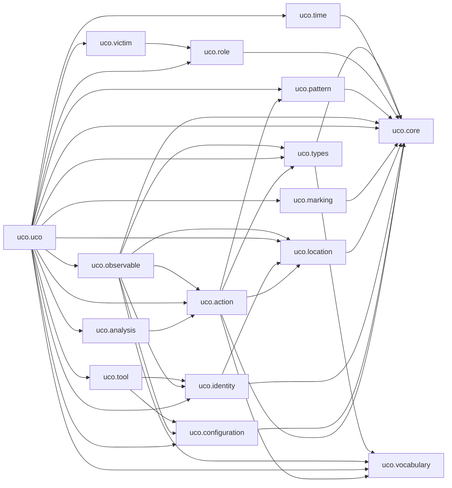
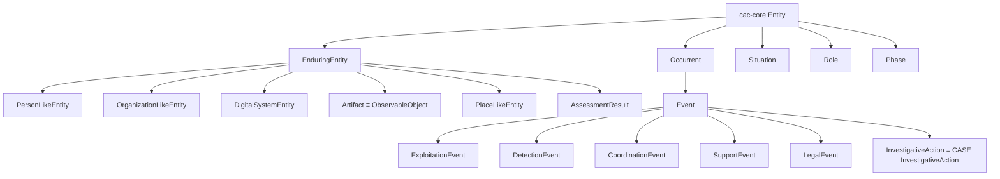

# Module dependency DAG

Observed `owl:imports` (and UCO `# imports:` comments) across vendored Turtle
files under `ontology/` and `extensions/`. Dependency edges are **from
importer → imported**. External W3C / SHACL / XSD IRIs are recorded in the
JSON but omitted from the diagrams.

Generated: `2026-08-15T09:24:36.850409+00:00`

- Turtle files scanned: **175**
- Logical modules: **119**
- Import edges: **533**

## Families

- **aeo**: 8 modules
- **cac**: 51 modules
- **case**: 4 modules
- **external**: 11 modules
- **other**: 7 modules
- **sdk-extension**: 5 modules
- **solveit**: 13 modules
- **uco**: 17 modules
- **upper**: 3 modules

## High-level topology

```mermaid
flowchart TB
  subgraph UCO["UCO 1.5.0"]
    uco_action["uco.action"]
    uco_analysis["uco.analysis"]
    uco_capability["uco.capability"]
    uco_configuration["uco.configuration"]
    uco_core["uco.core"]
    uco_identity["uco.identity"]
    uco_location["uco.location"]
    uco_marking["uco.marking"]
    uco_observable["uco.observable"]
    uco_pattern["uco.pattern"]
    uco_role["uco.role"]
    uco_time["uco.time"]
    uco_tool["uco.tool"]
    uco_types["uco.types"]
    uco_uco["uco.uco"]
    uco_victim["uco.victim"]
    uco_vocabulary["uco.vocabulary"]
  end
  subgraph CASE["CASE 1.5.0"]
    case_case["case.case"]
    case_criminal["case.criminal"]
    case_investigation["case.investigation"]
    case_vocabulary["case.vocabulary"]
  end
  subgraph CAC["CAC 3.1.0 spine + modules"]
    ext_cac_cac_core["ext.cac.cac-core"]
    cac_domain["50 CAC domain modules"]
  end
  subgraph EXT["SDK + vendored extensions"]
    ext_aeo["ext.aeo"]
    ext_aeo_ae_ontology["ext.aeo.ae_ontology"]
    ext_aeo_attack["ext.aeo.attack"]
    ext_aeo_engagement["ext.aeo.engagement"]
    ext_aeo_identity["ext.aeo.identity"]
    ext_aeo_objective["ext.aeo.objective"]
    ext_aeo_role["ext.aeo.role"]
    ext_aeo_vocabulary["ext.aeo.vocabulary"]
    ext_solveit_solve_it_kb["ext.solveit.solve-it-kb"]
    ext_solveit_solve_it_analysis["ext.solveit.solve_it_analysis"]
    ext_solveit_solve_it_core["ext.solveit.solve_it_core"]
    ext_solveit_solve_it_observable["ext.solveit.solve_it_observable"]
    ext_solveit_solve_it_observable_acquisition["ext.solveit.solve_it_observable_acquisition"]
    ext_solveit_solve_it_observable_search["ext.solveit.solve_it_observable_search"]
    ext_solveit_solve_it_observable_shapes["ext.solveit.solve_it_observable_shapes"]
    ext_solveit_solve_it_observable_timeline["ext.solveit.solve_it_observable_timeline"]
    ext_solveit_solve_it_sqlite["ext.solveit.solve_it_sqlite"]
    ext_solveit_solve_it_tool_profile["ext.solveit.solve_it_tool_profile"]
    ext_solveit_solve_it_weakness_assessment["ext.solveit.solve_it_weakness_assessment"]
    ext_solveit_solveit_local_anchors["ext.solveit.solveit-local-anchors"]
    ext_solveit_solveit_technique_catalog["ext.solveit.solveit-technique-catalog"]
    ext_cryptoinv_cryptoinv["ext.cryptoinv.cryptoinv"]
    ext_drugs_drug["ext.drugs.drug"]
    ext_rico_rico["ext.rico.rico"]
    ext_toolcap_toolcap["ext.toolcap.toolcap"]
    ext_weapons_weap["ext.weapons.weap"]
  end
  subgraph UPPER["Upper-ontology profiles"]
    upper_geosparql["upper.geosparql"]
    upper_org["upper.org"]
    upper_prov_o["upper.prov-o"]
  end
  ext_cryptoinv_cryptoinv --> uco_core
  ext_cryptoinv_cryptoinv --> uco_action
  ext_cryptoinv_cryptoinv --> uco_identity
  ext_cryptoinv_cryptoinv --> uco_observable
  ext_cryptoinv_cryptoinv --> case_investigation
  ext_toolcap_toolcap --> uco_capability
  ext_toolcap_toolcap --> uco_core
  ext_toolcap_toolcap --> uco_tool
  ext_toolcap_toolcap --> uco_action
  ext_toolcap_toolcap --> uco_marking
  ext_toolcap_toolcap --> uco_observable
  ext_toolcap_toolcap --> case_investigation
  ext_aeo --> uco_uco
  cac_domain --> ext_cac_cacontology
  cac_domain --> upper_gufo
  cac_domain --> uco_core
  cac_domain --> uco_identity
  cac_domain --> uco_observable
  cac_domain --> uco_action
  cac_domain --> uco_tool
  cac_domain --> ext_cac_cac_core
  cac_domain --> uco_role
  cac_domain --> case_case
  cac_domain --> case_investigation
  ext_cac_cac_core --> upper_gufo
  ext_cac_cac_core --> uco_core
  ext_cac_cac_core --> ext_cac_cacontology
  ext_cac_cac_core --> uco_action
  ext_cac_cac_core --> uco_observable
  ext_cac_cac_core --> uco_role
  ext_cac_cac_core --> case_investigation
  ext_cac_cac_core --> case_case
  cac_domain --> uco_pattern
  cac_domain --> uco_location
  cac_domain --> uco_types
  case_investigation --> case_vocabulary
  case_investigation --> uco_action
  case_investigation --> uco_role
  case_case --> case_investigation
  case_case --> case_vocabulary
  case_case --> uco_uco
  ext_solveit_solve_it_analysis --> uco_core
  ext_solveit_solve_it_analysis --> uco_observable
  ext_solveit_solve_it_analysis --> uco_analysis
  ext_solveit_solve_it_core --> uco_core
  ext_solveit_solve_it_core --> uco_observable
  ext_solveit_solve_it_core --> uco_action
  ext_solveit_solve_it_core --> case_investigation
  ext_solveit_solve_it_core --> ext_solveit
  ext_solveit_solve_it_observable --> uco_core
  ext_solveit_solve_it_observable --> uco_observable
  ext_solveit_solve_it_observable --> ext_solveit
  ext_solveit_solve_it_observable_acquisition --> uco_observable
  ext_solveit_solve_it_observable_search --> uco_observable
  ext_solveit_solve_it_observable_timeline --> uco_observable
  ext_solveit_solve_it_sqlite --> uco_core
  ext_solveit_solve_it_sqlite --> uco_observable
  ext_solveit_solve_it_tool_profile --> uco_core
  ext_solveit_solve_it_tool_profile --> uco_tool
  ext_solveit_solve_it_tool_profile --> uco_observable
  ext_solveit_solve_it_tool_profile --> ext_solveit
  ext_solveit_solve_it_weakness_assessment --> uco_core
  ext_solveit_solve_it_weakness_assessment --> uco_analysis
  ext_solveit_solve_it_weakness_assessment --> uco_identity
  ext_solveit_solve_it_weakness_assessment --> ext_solveit
  uco_action --> uco_core
  uco_action --> uco_location
  uco_action --> uco_pattern
  uco_action --> uco_types
  uco_action --> uco_vocabulary
  uco_analysis --> uco_action
  uco_configuration --> uco_core
  uco_identity --> uco_core
  uco_identity --> uco_location
  uco_location --> uco_core
  uco_marking --> uco_core
  uco_uco --> uco_action
  uco_uco --> uco_analysis
  uco_uco --> uco_configuration
  uco_uco --> uco_core
  uco_uco --> uco_identity
  uco_uco --> uco_location
  uco_uco --> uco_marking
  uco_uco --> uco_observable
  uco_uco --> uco_pattern
  uco_uco --> uco_role
  uco_uco --> uco_time
  uco_uco --> uco_tool
  uco_uco --> uco_types
  uco_uco --> uco_victim
  uco_uco --> uco_vocabulary
  uco_observable --> uco_action
  uco_observable --> uco_configuration
  uco_observable --> uco_core
  uco_observable --> uco_identity
  uco_observable --> uco_location
  uco_observable --> uco_types
  uco_observable --> uco_vocabulary
  uco_pattern --> uco_core
  uco_role --> uco_core
  uco_time --> uco_core
  uco_tool --> uco_configuration
  uco_tool --> uco_identity
  uco_types --> uco_core
  uco_types --> uco_vocabulary
  uco_victim --> uco_role
```

## UCO module imports (detail)

## CAC semantic spine

The Crimes Against Children Ontology organizes every domain class under
five kinds. Domain modules (grooming, forensics, trafficking, hotlines,
legal outcomes, …) **must** anchor to one of these rather than inventing
a parallel hierarchy.

## Heaviest importers

| Module | Family | Imports | Files |
|---|---|---:|---:|
| `uco.uco` | uco | 17 | 1 |
| `ext.cac.cacontology-tactical` | cac | 13 | 2 |
| `ext.cac.cacontology-physical-evidence` | cac | 12 | 2 |
| `ext.cac.cacontology-recruitment-networks` | cac | 12 | 2 |
| `ext.cac.cacontology-sextortion` | cac | 12 | 2 |
| `ext.cac.cacontology-ai-csam` | cac | 11 | 2 |
| `ext.cac.cacontology-asset-forfeiture` | cac | 11 | 2 |
| `ext.cac.cac-core` | cac | 11 | 4 |
| `ext.cac.cacontology-extremist-enterprises` | cac | 11 | 2 |
| `ext.cac.cacontology-forensics` | cac | 11 | 3 |
| `ext.cac.cacontology-grooming` | cac | 11 | 2 |
| `ext.cac.cacontology-legal-outcomes` | cac | 11 | 2 |
| `ext.cac.cacontology-multi-jurisdiction` | cac | 11 | 2 |
| `ext.cac.cacontology-platform-infrastructure` | cac | 11 | 2 |
| `ext.cac.cacontology-production` | cac | 11 | 2 |

See `module-dependency-dag.json` for the full edge list, per-file SHA-256,
and unresolved external IRIs.
