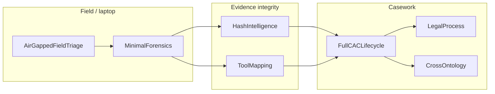

# Composition Profiles

Versioned, offline-loadable profiles that turn the 2,800-class topology into
a small set of correct starting points. Profiles do **not** change UCO, CASE,
or CAC — they declare which modules, Facet bundles, and spine anchors a
workflow should use.

Canonical JSON lives in this directory. The runtime loads them through
`case_uco.topology` (also re-exported from `case_uco.registry`). Agents
call the MCP tools `list_composition_profiles`, `get_composition_profile`,
`recommend_composition_profile`, `recommend_facet_set_for_profile`, and
`get_cac_semantic_spine`. Humans can run:

```bash
case-uco-explore profiles
case-uco-explore profile FullCACLifecycle
case-uco-explore spine
```

Those three explorer commands read JSON only. They do **not** parse OWL.

## The seven profiles



| Id | When to use it |
|---|---|
| `MinimalForensics` | File listing → hashed observables + one tool-backed action |
| `AirGappedFieldTriage` | Same, plus partition-by-boundary and RAM discipline |
| `HashIntelligence` | PhotoDNA / VICS-ready hashing and match actions |
| `ToolMapping` | Versioned tools, ConfiguredTool, SOLVE-IT methods |
| `LegalProcess` | Charges, pleas, sentences, PACER/docket |
| `FullCACLifecycle` | Hotline → grooming/trafficking → CSAM provenance → rescue → court |
| `CrossOntology` | CASE/UCO + CAC + legal/crypto + one upper profile |

See [docs/COMPOSITION_PROFILES.md](../../docs/COMPOSITION_PROFILES.md).
